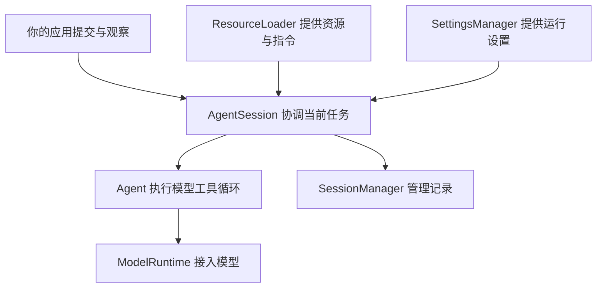
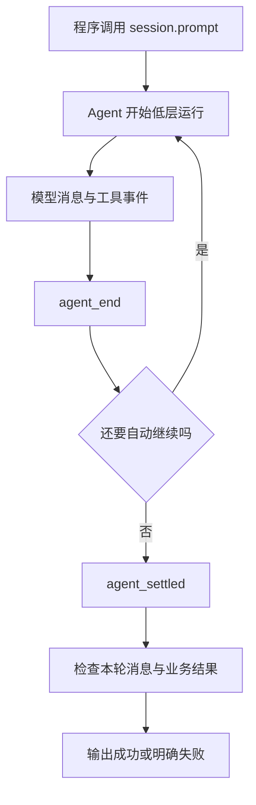

# 23 使用SDK提交与控制任务

## 用 SDK 把 Pi 放进自己的程序

终端里的一次请求，原来由 Pi 接收输入并展示结果。现在由你的 Node.js 程序负责输入和输出，Pi 继续负责模型、工具循环和会话。这就是 SDK 的用途，不需要模拟键盘，也不需要解析终端颜色。

## 把 Pi 嵌入程序，究竟接管了什么？

SDK 是供程序调用的公开接口。调用方决定什么时候提交任务、显示哪些内容、怎样判断业务成功，以及何时结束应用。Pi 提供已有的任务运行机制；你不需要为了嵌入它而重新写一次 Agent Loop。

它与 CLI 的主要区别不是模型更强，而是控制入口不同。Node.js 代码可以直接传入对象和订阅函数，取到结构化状态，不必把屏幕文字反向解析成程序结果。代价是原本由交互外壳处理的忙时输入、超时和退出，现在需要应用明确安排。

### 为什么一个 Session 要传入这么多依赖？

模型身份、资源发现、设置和记录有不同来源，也有不同寿命。若全藏在一个默认构造函数里，测试脚本即使使用固定回答，也可能先发现真实认证或自动加载本机扩展。

**依赖注入**在这里就是：由调用方把准备好的对象传进去，明确这次运行使用谁。内存 Session 只替换记录方式，不会顺便把认证、模型目录和资源发现也变成内存版本。所以隔离需要逐一对应真实依赖，不是给一个对象加上 `inMemory` 就全部完成。



图表示职责和主要协作，不是严格的构造顺序。后面的脚本会把这些依赖显式组装起来。

### prompt 返回的是答案吗？

`prompt()` 的返回值是 `Promise<void>`，它让程序等待调用收尾，并不直接返回一段答案。中途进度通过事件到达，消息和终态则需要从本轮事件与状态取得。把 `await` 的返回值直接显示为回答，会找错数据出口。

订阅是“以后有事件时通知我”的关系，不是过去事件的自动补播。应在任务开始前订阅，结束后取消订阅；如果需要旧记录，读 Session 或当前状态，而不是等待历史事件重新发生。

### AgentSessionRuntime 和 ModelRuntime 为什么都叫 Runtime？

Runtime 泛指运行时对象，但两者管理的对象不同。`ModelRuntime` 管模型接入；外层 `AgentSessionRuntime` 管当前活动会话及与工作目录绑定的服务，负责新会话、切换、Fork、Clone 和导入等整体替换流程。

`AgentSession` 可以处理当前记录里的树导航，但不包办整个应用的会话替换。替换后 `runtime.session` 可能是新对象，原订阅仍绑在旧对象上，扩展绑定也需要针对新会话重新建立。理解对象是否被替换，比单看名称都含有 Session 更重要。

## 1. 先分清五个对象

| 对象 | 负责什么 |
|---|---|
| `ModelRuntime` | 模型目录、认证和请求分发 |
| `ResourceLoader` | 加载所需扩展、Skill、模板、主题与上下文 |
| `SettingsManager` | 运行设置，如重试和压缩 |
| `SessionManager` | 会话记录、活动分支和持久化 |
| `AgentSession` | 对外提交任务、订阅事件、控制运行和协调以上对象 |

最短的 `createAgentSession()` 会采用默认认证、设置、工具、资源发现和磁盘 Session。它适合接受这些默认行为的应用，不适合直接当作隔离测试。

## 2. 事件和任务结果不是同一层



订阅返回取消订阅函数，应在清理时调用。文字增量可从 `message_update` 中的 `assistantMessageEvent.type === "text_delta"` 获取；它适合即时显示，不适合独自决定成功。

`agent_end` 可能之后接自动重试、压缩继续或待处理消息；`agent_settled` 表示没有后续自动工作，不表示任务正确。最终还要检查本轮消息的 `stopReason`、工具失败和自己的验收条件。

若一个 Session 连续跑多个任务，不能直接拿“历史最后一个成功回答”作为本次成功。记录提交前的消息边界或本轮标识，并且只接受本轮新增结果。本篇演示从空 Session 开始，所以不存在旧答案混入。

### 一次读取任务里，到底有几条消息、几个 Turn？

先不用记全部事件字段。假设程序要求读练习文件，模型先申请一次 `read`，收到结果后回答。没有重试、压缩或追加消息时，主线是：

| 阶段 | 发生的事 | 产生的新消息与主要通知 |
|---|---|---|
| 开始 | 已订阅的程序调用 `prompt()` | `agent_start`、第一轮 `turn_start`，用户消息的 `message_start/end` |
| 第一次模型生成 | Assistant 逐渐形成读取申请 | 一条 Assistant 的 `message_start`、零到多次 `message_update`、`message_end` |
| 处理工具 | 查找、校验、门禁，允许后执行 | `tool_execution_start`，可选 update，最终 end |
| 回填工具结果 | 得到带原调用 ID 的文件回执 | 一条 ToolResult 的 `message_start/end`，第一轮 `turn_end` |
| 第二次模型生成 | 新 Context 包含刚才的回执 | 第二轮 `turn_start`，另一条 Assistant 的消息生命周期，`turn_end` |
| 收尾 | 没有自动后续工作 | `agent_end`，外层收敛为 `agent_settled`，`prompt()` 完成 |

四条消息是“用户要求、工具申请、工具结果、最终回答”，两个 Turn 是“生成申请并处理工具”和“利用结果回答”。同一 Assistant 的 start/update/end 是它的生命周期，不是三条消息；update 即使有一百次，仍可能只形成这一条 Assistant。

工具进度主要给程序和界面看，最终 Tool Result 才是下一轮模型材料。`tool_execution_start` 又可能早于门禁，所以工具被拒绝时仍可看到 start/end 和错误 Tool Result。数到两个工具事件，不能证明 Executor 真正执行了两次，甚至不能证明执行过一次。

## 3. 从无工具扩展到只读任务

当前 API 的 `tools` 是名称允许列表，例如 `tools: ["read"]`，不是 Tool 对象数组。`tools: []` 明确不开放任何工具；省略则允许默认选择。

只开放 `read` 还不等于只能读练习文件。真正的任务合同需要在可信执行边界校验路径，再让内置 Executor 打开目标。路径策略和同用户文件替换竞态在[任务台](26-构建任务台与异常测试.md)继续讲。

自定义工具通过 `customTools` 注册；注册和启用是两件事。资源加载器也可以显式提供扩展工厂，但不能为了一个工具无意恢复所有本机资源。

假设已注册内置 `read`、`bash` 和自定义 `book_note`，逐次独立创建会话时：

| 选项 | 最终启用集合的关键结果 |
|---|---|
| `tools: ["read", "book_note"]` | 只允许这两个已注册名称 |
| 上项再加 `excludeTools: ["read"]` | 最终只剩 `book_note` |
| `tools: []` | 明确没有工具 |
| `noTools: "all"`，不传 tools | 默认集合为空 |
| `noTools: "all"`，同时传 `tools: ["read"]` | 显式列表优先，仍启用 read |
| `noTools: "builtin"`，不传 tools | 默认不启用内置工具，扩展和自定义工具仍可启用 |

可以把它读成“先决定默认或显式允许集合，再做排除”。未知名称不能创造工具，实现可能忽略它，所以创建后用 `getActiveToolNames()` 核对最终结果。动态启用也只能在已经注册并且允许的范围内进行；`customTools` 中放了定义，不代表一定已进入本次请求。

## 4. 取消、追加与重试

| API 或设置 | 使用时机 | 不保证什么 |
|---|---|---|
| `await session.abort()` | 请求取消并等待当前 Agent 运行停止 | 不回滚副作用，不保证远端停止计费 |
| `session.steer(text)` | 运行中调整后续方向 | 不抢占已经执行的工具 |
| `session.followUp(text)` | 当前工作之后追加一条请求 | 不等于立即开始另一个并发 Run |
| `prompt(text, { streamingBehavior: "steer" })` | 运行中明确选择改向行为 | 不代表原任务已结束 |
| `retry.enabled` | Agent 层可重试错误 | 不涵盖所有工具失败 |
| `retry.provider.maxRetries` | Provider 请求层重试 | 不是整个任务的总次数上限 |

运行中直接 `prompt()` 而不指定队列行为可能被拒绝。应用应明确选择“拒绝忙时提交”“改向”或“排队”，不要碰巧依靠 UI 输入速度。

长任务的超时也需要应用自己定义：到期先 `abort()`，等待活动 Promise 收尾，然后解除订阅和释放 Session；若依赖不响应，再由进程级期限处理。只调用 `dispose()` 不是等待所有工作结束的替代品。

把两种队列放进刚才的读取任务：工具还在运行时，程序先 `steer("只讨论统计条件")`，再 `followUp("完成后列出验证步骤")`。当前工具不会因此立即消失；工具批次结束后，转向消息在后续模型请求前交付。只有工具和转向工作都耗尽、低层原本准备结束时，后续消息才进入任务。

队列的 `one-at-a-time` 表示每个投递点取最早一条，`all` 表示取该队列当前全部消息；这不是并行运行多个 Prompt。`queue_update` 和待处理计数帮助观察入队与交付，尚未投递的文本不能当成模型已经收到。`clearQueue()` 清空并返回两类未处理消息，应用可留作草稿；取消当前工作与清理队列需要按自己的交互合同分别安排。

## 5. 压缩、保存和恢复

`await session.compact(instructions)` 会生成摘要，真实模型模式下可能调用服务。它不是纯本地整理，也不是删除磁盘旧历史。恢复时用 `SessionManager.open(...)` 或 `continueRecent(...)` 显式选定记录，再交给新会话。

`SessionManager.inMemory()` 不保存会话文件；`SessionManager.create(cwd, sessionDir)` 创建持久会话。持久化前要设计私有目录、单写者、损坏文件处理和输出脱敏，而不是简单换一个构造函数就宣称生产可用。

会话记录可能包含 Prompt、工具结果和回答。程序日志不要直接打印 `session.state` 或原始异常；显示固定状态和必要诊断，内容输出由独立合同控制。

保存与恢复也要沿完整过程看：任务中的消息定稿后追加到 Session，程序正常收尾并退出；下一次用明确路径打开记录，重建当前分支和压缩后的 Context，再创建新的 AgentSession、订阅并提交新任务。打开文件不会自动重跑昨天尚未完成的 Prompt，也不会恢复输入框里未发送的草稿。

如果进程恰好在工具改完文件、但回执尚未记录时崩溃，磁盘副作用与对话档案就可能不一致。第一条 Assistant 回复前的延迟落盘，以及流式消息尚未定稿的情况，也不能视为已可靠保存。恢复后要重新核对现场，不能把 JSONL 当作业务事务日志。

独立摘要有各自的取消入口：`abortCompaction()` 取消压缩，`abortBranchSummary()` 取消分支摘要。普通 `session.abort()` 主要针对 Agent 任务和等待中的重试，不包办所有独立后台工作。第 12 篇解释摘要材料和检查点，本篇只负责把它们接到程序生命周期中。

## 6. 用上一篇的脚本完成第一个任务

沿用独立练习目录、Pi `0.85.1` 依赖和 `book-provider.mjs`。本次唯一问题是：真实 SDK 会话能否使用内存 Provider，产生结果并收尾？不接真实服务，不开放工具，不保存磁盘 Session。

创建 `sdk-demo.mjs`：

```javascript
import assert from "node:assert/strict";
import { mkdtemp, rm } from "node:fs/promises";
import { tmpdir } from "node:os";
import { join } from "node:path";
import { InMemoryCredentialStore, InMemoryModelsStore } from "@earendil-works/pi-ai";
import {
  createAgentSession,
  DefaultResourceLoader,
  ModelRuntime,
  SessionManager,
  SettingsManager,
} from "@earendil-works/pi-coding-agent";
import { bookModel, bookProvider } from "./book-provider.mjs";

const root = await mkdtemp(join(tmpdir(), "book-sdk-"));
let session;
let unsubscribe;
try {
  const settings = SettingsManager.inMemory({
    retry: { enabled: false, provider: { maxRetries: 0 } },
    compaction: { enabled: false },
  });
  assert.equal(settings.getProviderRetrySettings().maxRetries, 0);
  const runtime = await ModelRuntime.create({
    credentials: new InMemoryCredentialStore(),
    modelsStore: new InMemoryModelsStore(),
    modelsPath: null,
    refreshOnCreate: false,
    allowModelNetwork: false,
  });
  runtime.registerNativeProvider(bookProvider);
  const loader = new DefaultResourceLoader({
    cwd: root,
    agentDir: join(root, "agent"),
    settingsManager: settings,
    noExtensions: true,
    noSkills: true,
    noPromptTemplates: true,
    noThemes: true,
    noContextFiles: true,
    systemPrompt: "Return the script response.",
    appendSystemPrompt: [],
  });
  await loader.reload();
  ({ session } = await createAgentSession({
    cwd: root,
    agentDir: join(root, "agent"),
    modelRuntime: runtime,
    model: bookModel,
    thinkingLevel: "off",
    tools: [],
    resourceLoader: loader,
    settingsManager: settings,
    sessionManager: SessionManager.inMemory(root),
  }));
  const events = [];
  unsubscribe = session.subscribe((event) => {
    events.push(event.type);
  });
  await session.prompt("Check the book script.");
  const assistant = session.state.messages.findLast((message) => message.role === "assistant");
  assert.ok(events.includes("agent_settled"));
  assert.equal(assistant?.stopReason, "stop");
  assert.equal(assistant.content[0].text, "BOOK_SCRIPT_OK");
  assert.deepEqual(session.getActiveToolNames(), []);
  console.log("SDK_SCRIPT_OK");
} finally {
  unsubscribe?.();
  session?.dispose();
  await rm(root, { recursive: true, force: true });
}
```

```bash
node sdk-demo.mjs
```

预期输出 `SDK_SCRIPT_OK`。这证明真实 SDK 与脚本 Provider 的一轮主线，不证明任何远端服务、真实认证或模型推理质量。临时目录只由本例创建并删除，不触碰已有目录。

内存凭据防止默认认证文件读取，内存目录缓存避免默认磁盘缓存，显式 `model` 避免选到别的模型。`noContextFiles` 只针对 Context File，所以还明确设置系统提示和空的追加提示列表。

`allowModelNetwork: false` 限制的是模型目录刷新，不是系统禁网。这个示例不联网的依据是实际选中的脚本没有网络 I/O；进程仍拥有当前用户的系统权限。

## 7. 一分钟回忆

> **SDK 让你的程序控制输入输出，AgentSession 协调任务；显式选择依赖、只认本轮结果、取消后等待、最后释放资源。**

现有[7.1 SDK 入门](../../labs/7.1-sdk/README.md)和[7.2 控制面](../../labs/7.2-sdk-controls/README.md)锁定 SDK `0.84.2`，不直接替换本篇 `0.85.1` 示例。先按[实验总入口](../../labs/README.md)区分 `check` 与真实调用：7.1 的 `check` 只检查类型与事件投影，7.2 的 `check` 使用脚本和 Fetch 替身；`demo`、`real` 会使用现有认证并请求真实模型。

上一篇：[自定义服务商扩展](22-自定义服务商扩展.md)。下一篇：[RPC协议与Java客户端](24-RPC协议与Java客户端.md)。
