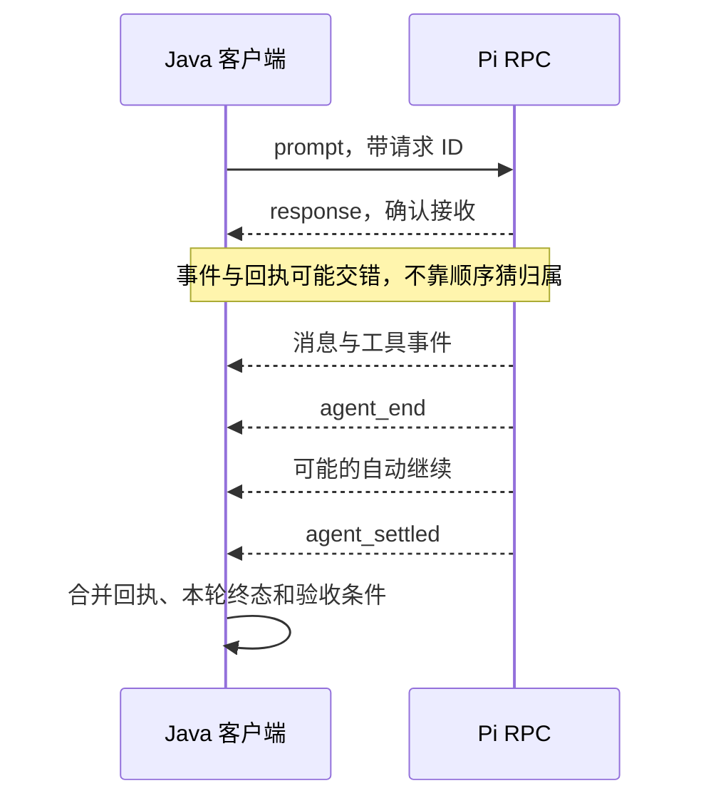

# 24 RPC协议与Java客户端

## 用 RPC 让 Java 程序控制 Pi

假设现有的代码审查程序用 Java 编写，你希望它把任务交给 Pi，并接收分析结果。Java 可以启动一个长期运行的 Pi 子进程，向它写入 JSON 命令，再读取返回的响应和事件。这个过程使用 RPC 协议，两边通过管道交换数据。

## RPC 把函数调用变成了什么？

RPC 意为远程过程调用，但这里的“远程”可以只是本机另一个进程。Java 无法直接拿着 Node.js 对象调用方法，于是把“请执行哪个操作、参数是什么”编码为消息，Pi 收到后再调用自己的功能。

这多出一条进程边界：对象必须序列化，错误必须通过协议或退出状态表达，任一边也可能先退出。好处是两边语言和发布方式可以独立；代价是你不能再假设一次本地函数调用就包含所有结果。

子进程拥有独立内存，但通常仍继承当前用户的系统权限。分进程有助于管理生命周期，不自动隔离文件、网络或凭据。

### 一次性 JSON 输出与 RPC 有什么本质差别？

一次性模式通常给输入、读完输出、等待进程退出。RPC 则把进程保留着，在持续输出事件的同时接收后续命令，例如查询状态或取消任务。客户端不能“先等整个任务结束，再读输出”，因为运行中的交互和有界管道都要求及时读取。

**管道缓冲区**是有限的暂存空间。若客户端不读 stdout 或 stderr，子进程写满后可能等待，双方就会互相卡住。遇到进程迟迟没有进展时，需要检查输出读取线程是否仍在工作。

### 为什么有 Command、Response 和 Event 三种记录？

Command 表达请求，Response 回答这个请求是否被接收或处理，Event 说明运行期间发生了什么。一条 Prompt Command 可以引发多轮模型请求与许多事件，因此不是“一问对应一行答案”。

请求 ID 只解决协议明确承诺的关联范围。它像回执上的编号，而不是自动附在所有后续工作上的任务身份。普通 Agent Event 没有这份编号，客户端就需要另一个可靠的归属策略；本例通过只允许一个活动 Prompt 消除歧义。

### 客户端怎样判断任务是否完成？

客户端状态机记录任务是否已发送、是否收到接收回执、本轮怎样结束，以及进程是否退出。客户端综合这些记录，判断何时可以向调用方返回本次任务的结果。

超时尤其体现这点：本地等待超时，只说明客户端不再愿意等；Pi 可能仍在运行。此时要发起取消或关闭，而不能把 Future 标成超时后遗忘下游。下面依次解释管道、分帧和事实合并，再看 Java 实现。

## 1. 三条管道各有用途

| 管道 | 方向 | 内容 |
|---|---|---|
| stdin | Java 到 Pi | Command 和扩展 UI 回答 |
| stdout | Pi 到 Java | Response、Agent Event、扩展 UI 请求 |
| stderr | Pi 到 Java | 独立诊断，不混入 JSON 协议 |

入口是 `pi --mode rpc`。它不显示本机交互编辑器；Java 必须持续消费输出，并处理超时、EOF 和退出。不要设置 `redirectErrorStream(true)`，否则普通错误文字可能破坏 JSON 流。

进程参数不自动限制工具。真实入口仍要显式指定模型、工具、资源和会话策略；启动成功也不代表已授权提交真实模型请求。

## 2. 一条记录只能由 LF 分隔

每个 JSON 对象序列化后追加 `\n` 并 flush。读取时只按 LF 分帧，可去掉 LF 前的单个 `\r`，从而接受 CRLF。

不能按网络块或 `read()` 返回次数切 JSON：一个对象可能被拆成多块，一块也可能包含多个对象。UTF-8 多字节字符也可能跨块，需要增量解码。

字符串中的 `U+2028`、`U+2029` 是合法数据，不是协议换行。不要用把所有 Unicode 行分隔符都当换行的通用拆行函数。

如果到 EOF 时还有一段没有 LF 结尾的数据，客户端需要明确怎样处理。现有 Java Lab 接受能够完整解析的最后一条记录；第 08 篇的一次性解析器则要求最后也有 LF。它们采用了不同的处理规则，但都必须拒绝被截断的 JSON。

## 3. 先区分回执与运行结果

Java 发出的命令：

```json
{"id":"book-1","type":"prompt","message":"只回复 BOOK_OK"}
```

Pi 的接收回执：

```json
{"id":"book-1","type":"response","command":"prompt","success":true}
```

`success: true` 仅表示已接受、排队或立即处理。普通模型任务仍会继续流出事件；接受后失败通常不会再给同一 ID 发送第二份失败 Response。



普通 Response 可以通过 `id` 关联并发命令。普通 Agent Event 通常没有请求 ID，因此本教程的客户端同一时间只允许一个活动 Prompt，不把两个任务的文字增量混在一起。

工具事件使用 `toolCallId` 关联。直接 RPC `bash` 的 `bash_execution_update` 可以带原命令 ID，这是特定事件的支持，不应推断所有事件都有 ID。

## 4. 四种结果比一个布尔值准确

| 结果 | 必要事实 |
|---|---|
| 成功 | 已接受、已 settled、本轮最终 Assistant 正常结束，且满足业务条件 |
| 接收前拒绝 | 对应 Response 为 `success: false` |
| 接收后失败 | 已接受，但最终消息错误、取消、截断或不满足任务要求 |
| 提前退出 | 尚未取得完整运行结果，子进程就结束或协议流异常 |

事件可能先于客户端处理回执到达，所以状态机要能先保存事件事实，再合并 accepted 状态。不要在看到 `agent_settled` 时丢弃还没读到的回执，也不要把 `agent_end` 当成完成。

当前 JSON 事件不携带每次更新的累计消息快照。文字按 `contentIndex` 组装增量，最终以 `message_end.message` 为准；历史上读取 `assistantMessageEvent.partial` 的代码需要按实际版本核对。

### 用一次回执交错检查客户端判断

假设只有一个活动 Prompt `book-1`。下面是客户端需要能够处理的虚构记录处理顺序，不承诺真实运行总按此顺序到达：

| 客户端刚处理的记录 | 此刻保存的事实 | 能否向调用者报告成功 |
|---|---|---|
| 本轮最终 `message_end`，文字为 BOOK_OK、stopReason 为 stop | 有候选最终回答 | 不能，回执和收尾尚未齐全 |
| `agent_end` | 低层结束 | 不能，仍可能自动继续 |
| `agent_settled` | 本轮已收尾 | 仍不能，对应接收回执尚未处理 |
| `book-1` 的成功 Response | 已确认接收，也已取得本次任务的结束状态 | 再核对工具结果和业务要求后才能成功 |

若最后一行迟迟不来，走本地超时和取消/关闭流程；不能因为已有一段好看的答案就补造 accepted。反过来，先收到成功 Response、随后 Assistant 报错并 settled，应判为接收后失败。这里合并的是不同事实，不是等待“最后到达的某种记录”覆盖此前状态。

普通状态查询可以与 Prompt 并存，其 Response 通过另一个 ID 找到对应 Future；Agent Event 仍由唯一活动 Prompt 接收。正因为事件通常不带请求 ID，本例拒绝第二个活动 Prompt，避免把 A 的回答算给 B。

## 5. 取消和退出分开做

`abort` 等待当前操作停止后响应，但队列中剩余内容可能继续执行。若要模拟交互界面的“停止并取回排队草稿”，先发 `clear_queue` 保存返回文本，再发 `abort`。

直接 Shell 命令使用 `abort_bash`。退出 Pi 时，还要关闭 stdin、等待子进程退出、读完剩余输出，再关闭流和线程池；超过设定的宽限期后才强制终止。收到 `abort` 的成功响应，不代表这些资源已经全部释放。

收到 stdout EOF 时，结合进程退出码和当前任务状态判断。退出码 `0` 也可能发生在尚未获得完整业务结果时；反过来，最后已生成答案也不代表清理失败可以忽略。

## 6. 扩展 UI 是另一组请求

RPC 中 `ctx.hasUI === true`，因为 Pi 能发 `extension_ui_request`，让客户端显示确认框。它不是本机 TUI；`ctx.mode === "rpc"`，自定义终端组件不在这里运行。

选择、确认、输入、编辑属于需要回答的对话，客户端按 UI 请求 ID 回 `extension_ui_response`。通知和状态更新通常不需要回答。

若客户端不支持危险操作审批，应明确拒绝或取消，不静默批准，也不让请求无限等待。TUI 内置 `/settings` 等命令不是任意 RPC Prompt 都能调用的服务接口，使用相应协议命令。

## 7. 看现有 Java 客户端怎样分工

仓库现有案例使用 Java 8、Jackson 和 JUnit 5，主要文件如下：

| 文件 | 读代码时关注什么 |
|---|---|
| [PiRpcClient.java](../../labs/7.4-rpc-java/src/main/java/com/xiexu/pistudy/rpc/PiRpcClient.java) | ProcessBuilder、Response Map、单活动 Prompt、三个 I/O 工作和 close |
| [StrictJsonlReader.java](../../labs/7.4-rpc-java/src/main/java/com/xiexu/pistudy/rpc/StrictJsonlReader.java) | 增量读取、LF 分帧、单条上限和尾记录 |
| [PromptRunResult.java](../../labs/7.4-rpc-java/src/main/java/com/xiexu/pistudy/rpc/PromptRunResult.java) | accepted、settled、最终状态与进程退出的不同含义 |

调用流程从 `start()` 开始：分别读 stdout、消费 stderr、观察进程退出。`sendCommand()` 先登记 ID 到 Future，再写入 JSON；写入失败要移除等待项。`runPrompt()` 先取得单任务占用，再同时等待回执和事件终态。

写端需要串行化一整条记录，避免两线程把 JSON 字符交错。退出时应让仍在等待的 Future 明确失败，不能遗留永远 pending 的调用。等待超时也不等于远端任务已经取消，调用方必须进入取消或关闭链。

将这个客户端用于自己的应用前，还应检查尾记录处理、解码错误和任务超时后的行为，并补充需要的协议失败测试。现有示例只覆盖已经明确实现和验证的场景。

## 8. 先运行假的子进程

从本仓库根目录执行；需要可用 JDK、Maven 和已经缓存的依赖：

```bash
java -version
mvn -version
mvn -o -B -f labs/7.4-rpc-java/pom.xml test
```

测试启动的是 `FakeRpcServerMain`，不是 Pi，不使用真实认证。预期覆盖：LF/CRLF/Unicode 分隔符保留、逆序 Response ID、accepted 后 settled 成功、接收前拒绝、接收后错误、提前退出和正常关闭。

`-o` 是 Maven 离线模式。缺少依赖缓存时先停止，确认依赖安装后再运行测试。这些测试覆盖前面列出的固定协议场景；真实 Provider、其他 Pi 版本和多 Prompt 并发仍需另行验证。

实现与真实入口说明见[7.4 Java RPC 实验](../../labs/7.4-rpc-java/README.md)，其他实验见[总入口](../../labs/README.md)。可执行 jar 与上面的假子进程测试不同：它会启动实际 Pi、使用现有认证并请求模型，需要单独确认 CLI 版本和费用。

上一篇：[使用SDK提交与控制任务](23-使用SDK提交与控制任务.md)。下一篇：[终端组件与界面刷新](25-终端组件与界面刷新.md)。
