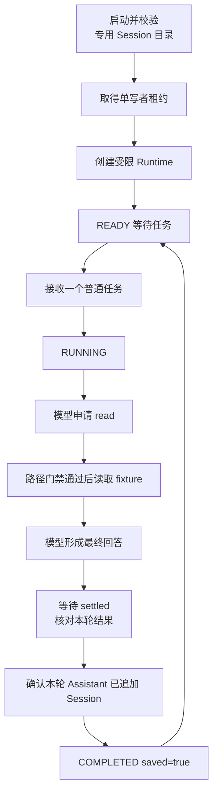
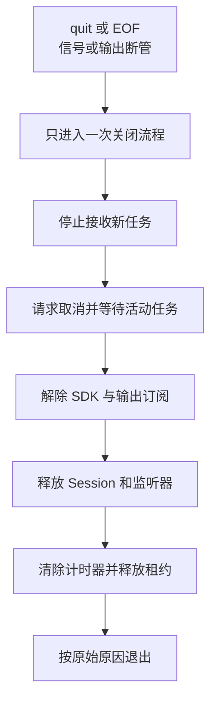

# 把 SDK 组织成一个可控的小任务台

SDK 示例能回答一次请求，还不是一个可以反复使用的程序。用户可能连输两条任务、取消后立刻退出，或者在保存记录时遇到磁盘错误。任务台需要把这些情况组织成明确状态。

本篇以仓库已有 `labs/7.7-sdk-task-console` 为案例。它锁定 Pi `0.84.3`，不因为新教程采用 `0.85.1` 就自动升级，也不要求从长代码里自行补齐概念。

## 从“调用一次”到“持续接收任务”，多出了哪些问题？

单次脚本通常只有一条清楚的时间线：创建、提交、等待、释放。持续程序却会在等待模型时收到新输入、取消和退出信号。运行不是暂停在那里，其他事件仍然会到达。

任务台要回答的核心问题是：**此刻谁拥有活动任务，哪些新动作仍然允许，结束后由谁释放资源？** 这是应用的控制逻辑，不是给模型多写一句“请按顺序操作”就能解决。

### 状态不是显示给用户看的几个词

READY 和 RUNNING 的意义在于允许的动作不同。RUNNING 时返回 `BUSY`，是拒绝启动第二份活动工作，而不仅是在屏幕上提醒“有点忙”。实现用活动 Promise 和关闭状态落实这份约束，不要求一定写成某种状态机框架。

请求取消之后，原任务仍可能在收尾。若马上清空占用并接收下一任务，旧回调就可能误改新任务状态。让活动 Promise 持有占用直到结束，才能把取消请求和资源释放连成一条完整时间线。

### 为什么控制器不直接处理每个 SDK 事件？

Controller 负责输入与任务关系，Runtime 负责把 SDK 的细节归纳为 completed、cancelled 或 failed。分工让“忙时拒绝第二任务”可以不启动 SDK 就验证，也让 SDK 的事件变化不必散布到终端读行代码里。

这不是为了将来任意更换框架，而是因为当前程序已经有两类不同判断：允许开始什么，以及已经开始的任务结果是什么。下面的四份文件对应实际存在的职责，没有必要再增加另一层通用平台。

### 为什么读文件也需要保存与输出合同？

只读说明工具不主动改业务文件，不说明整个应用没有写入。Session、日志和租约仍可能落盘，回答还可能包含终端控制字符。于是工具边界、记录边界和输出边界必须分别讲清。

`saved=true` 表达本例观察到本轮 Assistant 记录新增，不是承诺磁盘永不损坏。目录所有者标记回答“这是我管理的目录吗”，单写者租约回答“此刻是否由我写”，二者不能互相替代。租约通过竞争时只能一方成功的原子操作取得，避免两个进程都先检查为空，再同时开始写入。

先读任务合同和正常链，再看路径、持久化与关闭异常，最后用各层测试验证对应事实。不要一开始就把所有错误名当作必须背诵的清单。

## 1. 先定义一个小而完整的合同

这个任务台只接受单个活动任务，只开放 `read`，只允许读取仓库中的一个固定 fixture。它不是通用 Shell，也不是可以提交任意业务操作的聊天平台。

| 输入或情况 | 预期行为 |
|---|---|
| 空闲时普通文字 | 启动一个任务 |
| 运行中第二条普通文字 | 返回 `BUSY`，不排队 |
| `/cancel` | 请求协作取消，等待原任务真正结束 |
| `/quit` 或 EOF | 停止输入，进入清理链 |
| 空行 | 忽略 |
| 超过输入长度上限 | 明确失败，不提交模型 |

单任务合同省掉了事件归属和多个 Writer 竞争的歧义。以后是否扩展并发是另一个需求，不在当前实现里预留多种模式。

## 2. 正常任务从哪里开始、在哪里完成？



成功需要多份相互补充的事实：本轮正常结束、没有锁存的工具失败、最终文字非空、已经 settled，并且本轮 Assistant 条目确实新增。仅仅 `prompt()` 返回或看到一行回答都不够。

答案单独输出为一个 JSON 转义后的物理行。换行、ANSI 和危险控制序列不能伪造新的状态记录；诊断不打印原始 Prompt、Session 路径或完整错误。

## 3. 只读工具还需要路径合同

允许的相对路径精确为 `labs/7.7-sdk-task-console/fixture.txt`，也接受由仓库根解析得到的同一规范绝对路径。其他文件、路径别名、链接、目录、缺失文件和取消态都拒绝。

检查必须在 Executor 之前生效。如果既有 Hook 会改写参数，最终实际执行参数仍需符合相同合同；不能只检查改写前的值。拒绝后形成固定错误 Tool Result，Executor 调用次数为零。

任务台将先发生的工具合同失败锁存为失败，后续模型即使说“成功”也不能覆盖。若取消先发生，随后因取消产生的 Tool error 保持取消结论，不能反过来伪装成另一种业务失败。

文件路径检查结束到内置工具打开文件之间仍有同用户替换目标的时间窗口，称为 TOCTOU。进程内门禁不等于 OS 沙箱；需要更强边界时使用受限用户或系统隔离，不靠增加自然语言提醒。

## 4. 持久化不是找到一个目录就开始写

专用 Session 目录含固定所有者标记和单写者租约。程序先检查归属与文件类型，再决定是否接管；遇到陌生文件、链接或损坏记录时拒绝，而不是自动清理用户数据。

POSIX 目录权限为 `0700`，只允许当前用户遍历。实际 JSONL 文件权限仍要单独看，不能因为目录私有就声称文件自身一定是 `0600`。

租约用于同一 SessionDir 的单写者控制。已有租约时不按 PID 猜测并自动删除，因为 PID 复用或竞争可能破坏互斥。崩溃、断电或 `SIGKILL` 后残留租约需要人工确认，或改用新的专用目录。

记录校验和版本合同属于当前任务台，不应据此假定 Pi 所有入口都以同样方式拒绝旧文件。

## 5. 取消、退出和清理是一条有顺序的链



取消按钮只发请求；原任务 Promise 仍持有运行资源，真正完成前不能允许下一任务覆盖状态。重复信号也不能启动第二套清理。

正常 `/quit` 或 EOF 退出 `0`；`SIGINT` 对应 `130`，`SIGTERM` 对应 `143`。宽限期超时或第二次信号才升级硬退出。`EPIPE` 表示下游关闭输出管道，应停止继续写 stdout，最多向仍可用的 stderr 给出有界诊断，再清理。

这里的“恰好一次”是协作关闭代码的所有权合同，不保证 `SIGKILL`、断电或远端服务已经停止计算。

## 6. 四份生产文件怎样合作

从[任务台目录](../../labs/7.7-sdk-task-console/)可以定位实现：

| 文件 | 所有权 |
|---|---|
| `task-console.ts` | 进程入口、终端输入、信号和依赖组装 |
| `task-console-controller.ts` | READY/RUNNING、BUSY、取消与关闭协调 |
| `task-console-runtime.ts` | SDK、固定模型、工具与 Session 合同 |
| `safe-output.ts` | 固定状态记录、答案转义和诊断脱敏 |

先从入口找出谁创建谁，再顺着一次普通输入走到 Runtime。不要从 JSONL 校验器或几十个错误分支开始读，否则容易失去主线。

## 7. 怎样看失败才不会被全绿迷惑？

记录失败命令、退出码、首个不符合合同的观察，以及恢复后的同一断言。预期拒绝必须检查执行次数为零；预期取消必须检查没有后续 `COMPLETED`；预期清理必须检查监听器、进程和租约，而不是只等测试函数返回。

完整任务台不意味着阶段 8.8 毕业验收已经完成。这里复用既有案例讲清程序集成和异常，毕业项目、网站和新业务系统是独立范围。

## 8. 测试从纯逻辑逐步走到真实进程

依赖已经按该 Lab 锁文件准备时，从仓库根目录运行：

```bash
npm --prefix labs/7.7-sdk-task-console run check
```

若依赖缺失，先停下并单独确认安装。不要运行 `console` 或 `smoke` 来代替离线检查，它们可能解析真实认证，普通 Prompt 或 smoke 会调用真实模型。

| 层次 | 输入 | 能证明什么 |
|---|---|---|
| Controller 单测 | Fake Runtime | BUSY、状态转换、取消所有权和重复关闭 |
| Runtime 集成 | 真实 SDK + 脚本模型 + 内存凭据 | 工具拒绝、结果锁存、Session 追加与主线接线 |
| 子进程测试 | Fake Controller 或租约进程 | LF/CRLF、EOF、信号、退出码、EPIPE 和互斥 |
| 真实 TTY | 人工输入与退出 | 当前终端的交互和信号行为 |
| 真实模型 | 授权的一次固定任务 | 当前模型与固定输入的实际链路 |

Fake Provider 并不天然隔离认证文件。测试要显式注入内存凭据、受控资源和专用目录，并核对实现有没有退回默认加载。

## 9. 一分钟回忆

> **先定单任务合同，再把输入、运行、持久化和清理分别交给明确的所有者；失败与取消也必须走到可判断的终点。**

具体入口与退出要求见[7.7 任务台运行说明](../../labs/7.7-sdk-task-console/README.md)。需要组合已有成果时，再看[8.8 综合运行手册](../../labs/8.8-capstone/README.md)；它是独立验收范围，不因本篇或自动检查通过而完成。实验版本与调用分类统一见[实验总入口](../../labs/README.md)。

上一篇：[终端组件与界面刷新](24-终端组件与界面刷新.md)。下一篇：[源码总图与环境准备](26-源码总图与环境准备.md)。
