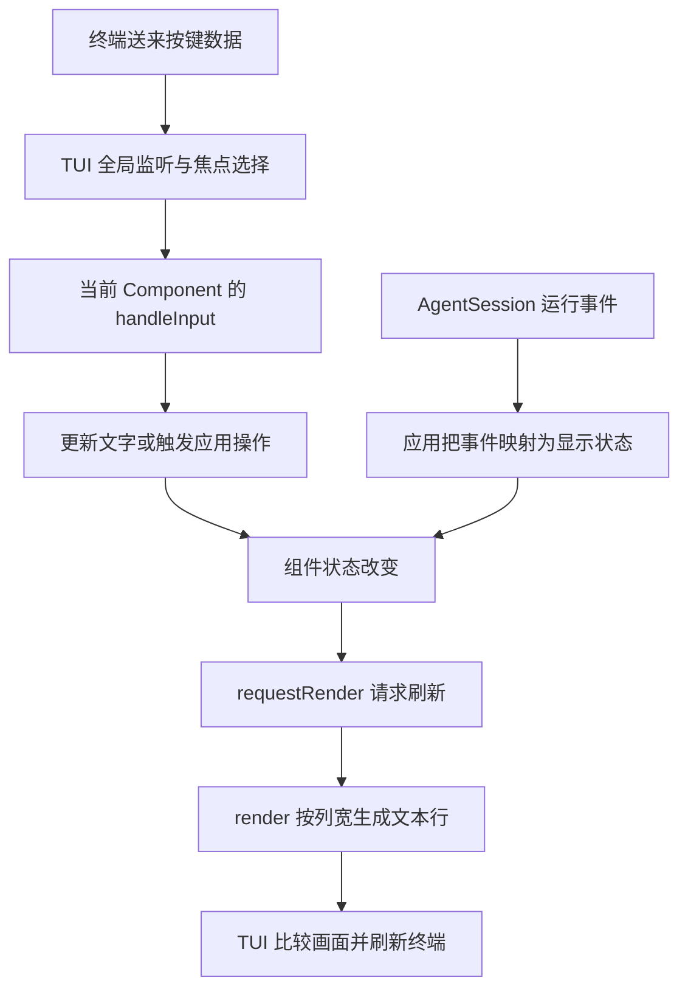

# 终端界面怎样接收输入和显示状态

在 Pi 里打开一个书名输入框，你输入文字、按 Return 确认，然后回到主编辑器。这里既没有模型必须参与的推理，也没有文件必须保存的动作。TUI 处理的是按键、焦点、组件状态和终端刷新。

## 终端为什么需要一套界面组件？

终端不像网页那样直接提供输入框和按钮。它主要送来输入数据，并按照输出字符与控制序列更新画面。TUI 在这层能力上组织编辑器、列表和对话框，让应用不必每次手工计算光标位置。

**ANSI 控制序列**是终端理解的显示或光标指令，不是普通可见文字。混入一段未经处理的外部输出，可能影响画面而不只是多显示几个字符。所以组件应该交回渲染结果，由 TUI 统一写终端，而不是各自任意打印。

### render 为什么只返回文本行，不直接画屏幕？

组件只知道自己的内容和给定列宽，不一定知道整屏布局。先生成文本行，Container 才能组合多个组件，TUI 才能比较前后画面，只刷新变化部分。这里的“差异刷新”是比较显示结果，不是比较 Git 文件差异。

这也使组件可独立测试：给同样状态和列宽，检查输出行是否符合合同，不需要每次启动真实终端。但终端协议和输入法的位置仍属于更外层，不能被方法测试顺便证明。

### 焦点、可见和存活为什么要分开？

对话框可以可见但暂时不接收按键，后台任务可以在对话框关闭后继续运行，组件也可能已经销毁但旧回调仍持有它的引用。**焦点**决定输入归谁，**可见性**决定是否显示，**生命周期**决定对象能否继续使用。

因此 Container 放进一个 Input 还不够：按键和焦点都要传过去。关闭 Overlay 后重新打开也应创建新实例，不能仅把旧画面重新展示就当作对象已经恢复。

### invalidate 与 requestRender 为什么是两步？

前者说明“以前算好的显示结果已经过期”，后者说明“请安排一次刷新”。只请求刷新却继续返回旧缓存，画面可能不变；只清缓存却不请求刷新，新画面可能迟迟没有呈现。

组件状态、宽度和主题都会影响显示。缓存如果只记文字、不记宽度，缩窄窗口后就可能越界。应用也不应在 `render()` 里重新提交模型任务，否则每次窗口刷新都可能重复产生副作用。

## 1. 先认识几个界面零件

| 对象 | 日常含义 |
|---|---|
| Component | 能根据给定列宽生成多行文本的零件 |
| Container | 把多个零件竖向组合起来 |
| Input | 保存单行文字、光标，处理编辑和提交 |
| Editor | 更完整的多行编辑器；Pi 主编辑器还附带应用快捷键 |
| Overlay | 盖在原内容上的临时界面，不等于新会话 |
| Focus | 决定当前按键交给谁 |

基础 `Input` 不负责模型搜索、资源补全或任务提交。Container 把 Input 放进画面，也不会自动把所有按键广播给它；必须明确输入路由。

## 2. 输入与显示是两条相反方向的链



TUI 不应自行认定模型任务成功。任务结果由 AgentSession 和应用合同判断，界面只是把事实变成颜色、文字和进度。刷新成功不证明文件写入成功；转圈停止也不证明任务正常完成。

## 3. 列宽、颜色和缓存

终端按显示列计算，不按 JavaScript `string.length` 计算。汉字、组合字符和 ANSI 控制码会让两者不同。每条 `render(width)` 输出都应满足 `visibleWidth(line) <= width`。

需要截断时用 `truncateToWidth()`，需要带样式换行时用 `wrapTextWithAnsi()`，不要直接 `slice(0, width)` 截断转义序列。优先用已有 Text、SelectList、SettingsList 等组件。

状态改变后先让缓存失效，再 `requestRender()`。主题颜色若已提前嵌入字符串，`invalidate()` 还要重新生成这些字符串，仅清空行缓存不够。颜色从回调传入的 Theme 获取，不长期持有旧主题生成的结果。

## 4. 一个可独立测试的书名组件

独立练习项目需要 `@earendil-works/pi-tui@0.85.1`。依赖安装属于单独动作，未安装时先审查并确认，不让运行示例自动下载。

创建 `book-dialog.mjs`：

```javascript
import { Container, Input, Text } from "@earendil-works/pi-tui";

export class BookDialog extends Container {
  input = new Input();
  _focused = false;

  constructor(done, refresh) {
    super();
    this.refresh = refresh;
    this.addChild(new Text("书名", 0, 0));
    this.addChild(this.input);
    this.input.onSubmit = (text) => done(text.trim() || null);
    this.input.onEscape = () => done(null);
  }

  get focused() { return this._focused; }
  set focused(value) {
    this._focused = value;
    this.input.focused = value;
  }

  handleInput(data) {
    this.input.handleInput(data);
    this.refresh();
  }
}
```

Container 提供 `render(width)` 和 `invalidate()`；这里补上输入路由，并把父组件焦点传给 Input。中文输入法需要正确的光标定位，这不是只把边框画亮就能替代的。

`done(value)` 是这个组件的完成回调，不是模型任务完成事件。`refresh()` 通知外部安排刷新，不直接往 stdout 混写终端内容。

## 5. 不开终端也能先验证组件合同

创建 `check-dialog.mjs`：

```javascript
import assert from "node:assert/strict";
import { visibleWidth } from "@earendil-works/pi-tui";
import { BookDialog } from "./book-dialog.mjs";

const results = [];
let renders = 0;
const dialog = new BookDialog((value) => results.push(value), () => renders++);
dialog.focused = true;
assert.equal(dialog.input.focused, true);
dialog.handleInput("小书架");
for (const width of [12, 40, 80]) {
  const lines = dialog.render(width);
  assert.ok(lines.length > 0);
  assert.ok(lines.every((line) => visibleWidth(line) <= width));
}
dialog.handleInput("\r");
assert.deepEqual(results, ["小书架"]);
assert.equal(renders, 2);

const cancelled = new BookDialog((value) => results.push(value), () => {});
cancelled.handleInput("\x1b");
assert.equal(results[1], null);
console.log("TUI_COMPONENT_OK");
```

```bash
node check-dialog.mjs
```

这里直接调用组件方法，检查文字、提交、取消、焦点传递和列宽，没有操作真实桌面或终端。`TUI_COMPONENT_OK` 不证明中文输入法候选框位置、终端键盘协议或 Overlay 焦点恢复。

## 6. 接到扩展命令上

在独立练习目录创建 `book-dialog-extension.mjs`：

```javascript
import { BookDialog } from "./book-dialog.mjs";

export default function register(pi) {
  pi.registerCommand("book-title", {
    description: "填写练习书名",
    async handler(_args, ctx) {
      if (ctx.mode !== "tui") throw new Error("本命令需要本机 TUI");
      const title = await ctx.ui.custom((tui, _theme, _keys, done) =>
        new BookDialog(done, () => tui.requestRender()),
        { overlay: true },
      );
      if (title !== null && title !== undefined) ctx.ui.notify(title, "info");
    },
  });
}
```

按第 15 篇的方法显式加载该扩展，再输入 `/book-title`。应出现书名输入框，Return 确认后通知书名，Esc 取消后不通知，并把输入焦点交回原界面。此流程不需要提交普通 Prompt。

Overlay 关闭后，原组件可能已经被释放。再次打开要创建新实例，不能复用已经关闭的引用。多个 Overlay 的可见顺序和焦点所有权也不能简单等同；隐藏界面时要处理焦点回退。

## 7. 一分钟回忆

> **焦点决定输入给谁，组件保存显示状态，刷新把状态投影到终端；界面生命周期和 Agent 任务生命周期分别管理。**

上一篇：[RPC协议与Java客户端](24-RPC协议与Java客户端.md)。下一篇：[构建任务台与异常测试](26-构建任务台与异常测试.md)。
