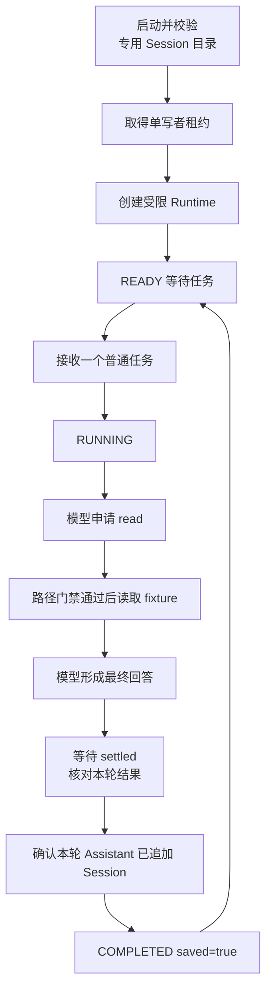
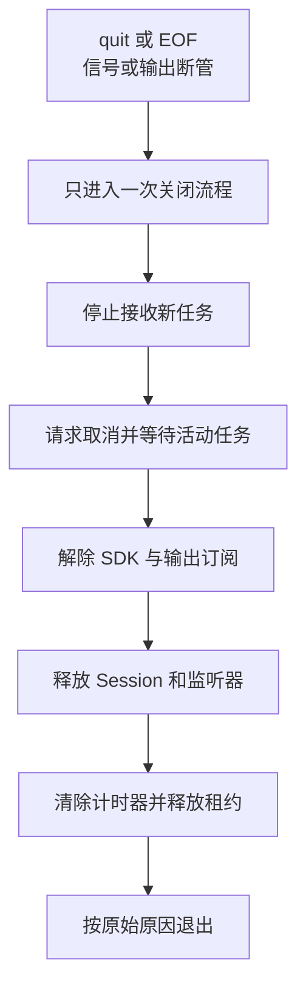

# 26 构建任务台与异常测试

## 把 SDK 组织成一个可控的小任务台

前面的 SDK 脚本完成一次请求就退出。现在看一个持续运行的终端程序：你可以输入要求，让 Pi 读取准备好的练习文件并回答；任务完成后，程序继续等待下一条输入。运行中还可以取消任务或退出。这里把这个程序称为“任务台”。

持续接收输入后，就需要处理新的情况：前一项任务没结束，用户又输入了下一项；取消刚发出，用户马上退出；回答已经生成，保存会话却失败。本篇沿这些情况介绍任务控制和资源清理，案例使用仓库已有的 `labs/7.7-sdk-task-console`，锁定 Pi `0.84.3`。

## 从“调用一次”到“持续接收任务”，多出了哪些问题？

单次脚本通常只有一条清楚的时间线：创建、提交、等待、释放。持续程序却会在等待模型时收到新输入、取消和退出信号。运行不是暂停在那里，其他事件仍然会到达。

任务台需要记录哪项任务正在运行，按当前状态接受或拒绝新操作，并在任务结束后释放资源。这些行为由应用代码控制。

### 状态怎样决定当前允许的操作？

READY 时可以接收新任务，RUNNING 时收到第二项任务则返回 `BUSY`。实现通过保存活动 Promise 和检查关闭状态，控制何时允许开始下一项工作。

请求取消之后，原任务仍可能在收尾。若马上清空占用并接收下一任务，旧回调就可能误改新任务状态。让活动 Promise 持有占用直到结束，才能把取消请求和资源释放连成一条完整时间线。

### 为什么控制器不直接处理每个 SDK 事件？

Controller 负责输入与任务关系，Runtime 负责把 SDK 的细节归纳为 completed、cancelled 或 failed。分工让“忙时拒绝第二任务”可以不启动 SDK 就验证，也让 SDK 的事件变化不必散布到终端读行代码里。

这样可以分别检查两件事：Controller 是否在正确时间接受或拒绝输入，Runtime 是否正确判断 Pi 的运行结果。后面的文件分工和测试也按这两类职责展开。

### 只读任务为什么也要考虑保存和输出？

工具只读业务文件，应用仍可能保存 Session、日志和租约。回答也可能包含终端控制字符，因此除了限制工具操作，还需要管理记录的写入，并在输出回答前处理这些字符。

`saved=true` 表示本例已观察到本轮 Assistant 记录新增。目录所有者标记用于确认目录由本程序管理，单写者租约用于控制当前由哪个进程写入。租约通过竞争时只能一方成功的原子操作取得，避免两个进程都先检查为空，再同时开始写入。

下面先说明任务台接受哪些输入，再沿一次正常任务介绍读取、回答和保存，最后讨论失败与退出。测试也按这些步骤检查实际结果。

## 1. 任务台接受哪些输入？

这个任务台一次只运行一个任务，只开放 `read`，读取范围限定为仓库中的一份固定练习文件。用户可以围绕这份文件提问，不能用它执行任意 Shell 命令或操作其他业务文件。

| 输入或情况 | 预期行为 |
|---|---|
| 空闲时普通文字 | 启动一个任务 |
| 运行中第二条普通文字 | 返回 `BUSY`，不排队 |
| `/cancel` | 请求协作取消，等待原任务真正结束 |
| `/quit` 或 EOF | 停止输入，进入清理链 |
| 空行 | 忽略 |
| 超过输入长度上限 | 明确失败，不提交模型 |

一次只运行一个任务，收到的事件就能归到当前任务，也不会有多个活动任务同时写会话记录。本例按这个规则处理忙时输入。

## 2. 正常任务从哪里开始、在哪里完成？



报告成功前，任务台会检查：本次模型响应正常结束，没有已经记录的工具失败，最终文字非空，运行已 settled，而且本次 Assistant 消息已追加到 Session。`prompt()` 返回或屏幕上出现回答，只说明其中一部分步骤完成。

答案单独输出为一个 JSON 转义后的物理行。换行、ANSI 和危险控制序列不能伪造新的状态记录；诊断不打印原始 Prompt、Session 路径或完整错误。

## 3. 怎样限制读取路径？

允许的相对路径精确为 `labs/7.7-sdk-task-console/fixture.txt`，也接受由仓库根解析得到的同一规范绝对路径。其他文件、路径别名、链接、目录、缺失文件和取消态都拒绝。

路径检查要在 Executor 打开文件前生效。如果其他 Hook 会改写参数，也要确保最终执行的路径符合相同限制。拒绝时返回固定的错误 Tool Result，并确认 Executor 没有运行。

如果工具调用先违反了读取规则，任务台会保留这次失败，后续模型回复“成功”也不能覆盖它。如果取消先发生，随后读取因取消而报错，则保留取消状态。判断结果时，需要同时看错误原因和发生顺序。

文件路径检查结束到内置工具打开文件之间仍有同用户替换目标的时间窗口，称为 TOCTOU。进程内门禁不等于 OS 沙箱；需要更强边界时使用受限用户或系统隔离，不靠增加自然语言提醒。

## 4. 保存会话前需要检查什么？

专用 Session 目录含固定所有者标记和单写者租约。程序先检查归属与文件类型，再决定是否接管；遇到陌生文件、链接或损坏记录时拒绝，而不是自动清理用户数据。

POSIX 目录权限为 `0700`，只允许当前用户遍历。实际 JSONL 文件权限仍要单独看，不能因为目录私有就声称文件自身一定是 `0600`。

租约用于同一 SessionDir 的单写者控制。已有租约时不按 PID 猜测并自动删除，因为 PID 复用或竞争可能破坏互斥。崩溃、断电或 `SIGKILL` 后残留租约需要人工确认，或改用新的专用目录。

这些记录检查和版本要求由本任务台实现，Pi 的其他入口可能采用不同的文件处理方式。

## 5. 取消、退出和清理是一条有顺序的链



取消按钮只发请求；原任务 Promise 仍持有运行资源，真正完成前不能允许下一任务覆盖状态。重复信号也不能启动第二套清理。

正常 `/quit` 或 EOF 退出 `0`；`SIGINT` 对应 `130`，`SIGTERM` 对应 `143`。宽限期超时或第二次信号才升级硬退出。`EPIPE` 表示下游关闭输出管道，应停止继续写 stdout，最多向仍可用的 stderr 给出有界诊断，再清理。

这里要求关闭流程只执行一次，避免重复释放资源。`SIGKILL` 或断电时仍无法保证清理代码运行，本地退出也不证明远端服务已经停止计算。

### 取消后立刻提交，再立刻退出，会发生什么？

假设任务 A 正在等文件读取。用户连续输入 `/cancel`、任务 B、`/quit`：

1. Controller 请求取消 A，但仍保留 A 的活动 Promise；此时只是要求停止，还没有完成资源交接。
2. B 到达时 A 尚未结束，所以返回 `BUSY`，不覆盖 A，也不把 B 加入队列。
3. `/quit` 让 Controller 进入唯一关闭流程，停止接收输入，并复用取消与等待链。
4. A 的下游响应取消，Runtime 形成相应结果；原活动 Promise 完成后，关闭流程才解除订阅、释放 Session 与租约。
5. 即使随后又收到 EOF，也复用已有关闭过程，不第二次关闭或写入成功答案。若 A 永不返回，则由有界关闭期限处理，不把等待无限留给用户。

再改变先后顺序做对照：如果路径门禁先明确失败，稍后用户才取消，原失败不能被取消文案擦掉；如果先取消，读取因取消抛错，则应保持取消结论。保存首个有效失败事实，就是为了让迟到事件不能覆盖已有判断。

这些行为分别由 Controller 的 Fake 测试、真实 SDK 加脚本模型的集成测试和进程退出测试覆盖。无须请求真实模型才能制造这组竞争，但测试必须检查 B 未启动、A 没有迟到成功以及清理次数，不能只检查某行输出出现了 CANCELLED。

## 6. 四个实现文件怎样合作？

从[任务台目录](../../labs/7.7-sdk-task-console/)可以定位实现：

| 文件 | 负责的工作 |
|---|---|
| `task-console.ts` | 进程入口、终端输入、信号和依赖组装 |
| `task-console-controller.ts` | READY/RUNNING、BUSY、取消与关闭协调 |
| `task-console-runtime.ts` | SDK、固定模型、工具限制与 Session 保存 |
| `safe-output.ts` | 固定状态记录、答案转义和诊断脱敏 |

先从入口找出谁创建谁，再顺着一次普通输入走到 Runtime。不要从 JSONL 校验器或几十个错误分支开始读，否则容易失去主线。

## 7. 怎样看失败才不会被全绿迷惑？

测试失败时，记录命令、退出码和实际结果与预期的第一处差异；修复后再运行同一断言。验证拒绝时检查执行次数是否为零，验证取消时检查后面是否仍出现 `COMPLETED`，验证清理时检查监听器、进程和租约是否释放。

## 8. 测试从纯逻辑逐步走到真实进程

依赖已经按该 Lab 锁文件准备时，从仓库根目录运行：

```bash
npm --prefix labs/7.7-sdk-task-console run check
```

若依赖缺失，先停下并单独确认安装。不要运行 `console` 或 `smoke` 来代替离线检查，它们可能解析真实认证，普通 Prompt 或 smoke 会调用真实模型。

| 层次 | 输入 | 能证明什么 |
|---|---|---|
| Controller 单测 | Fake Runtime | BUSY、状态转换、取消所有权和重复关闭 |
| Runtime 集成 | 真实 SDK + 脚本模型 + 内存凭据 | 工具拒绝、失败状态保留、Session 追加与任务执行 |
| 子进程测试 | Fake Controller 或租约进程 | LF/CRLF、EOF、信号、退出码、EPIPE 和互斥 |
| 真实 TTY | 人工输入与退出 | 当前终端的交互和信号行为 |
| 真实模型 | 授权的一次固定任务 | 当前模型与固定输入的实际链路 |

Fake Provider 并不天然隔离认证文件。测试要显式注入内存凭据、受控资源和专用目录，并核对实现有没有退回默认加载。

具体入口与退出要求见[7.7 任务台运行说明](../../labs/7.7-sdk-task-console/README.md)。需要把任务台与其他实验组合使用时，可查看[8.8 综合运行手册](../../labs/8.8-capstone/README.md)。各实验的版本和运行方式见[实验总入口](../../labs/README.md)。

上一篇：[终端组件与界面刷新](25-终端组件与界面刷新.md)。下一篇：[源码总图与环境准备](27-源码总图与环境准备.md)。
