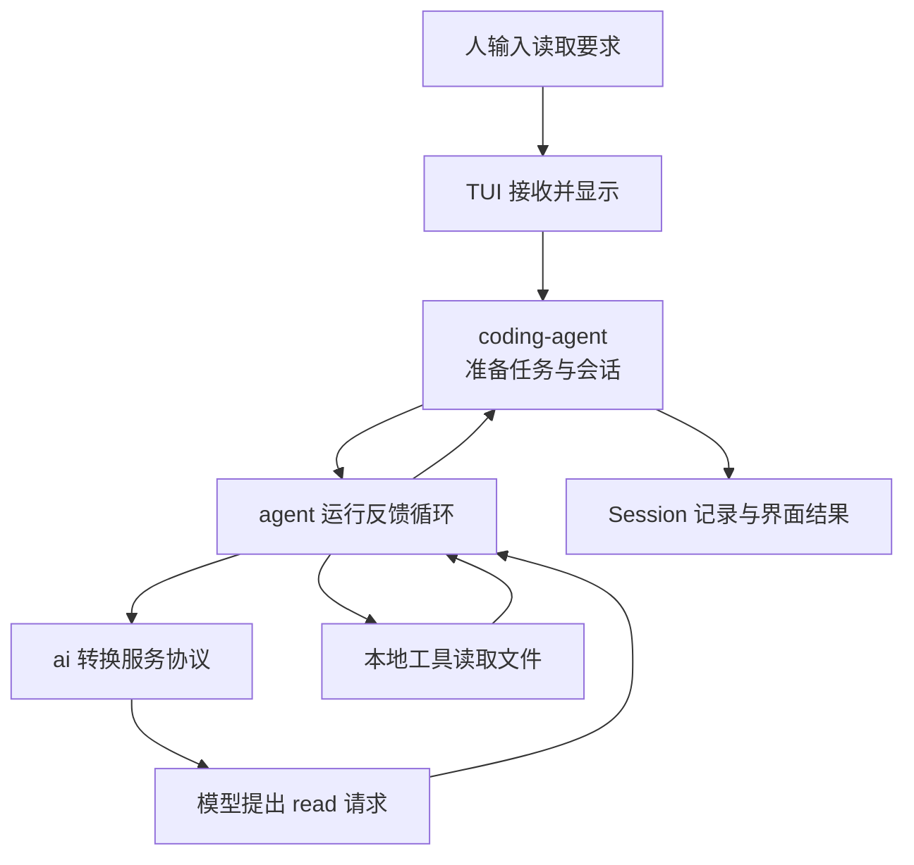

# 带着一个任务进入 Pi 源码

已经知道怎样使用 Pi 后，读源码要回答更深一层的问题：为什么界面、模型请求、工具循环和会话记录没有写在一个巨大函数里？这种分工怎样帮助我们定位故障？

继续使用“读取一个文件，只返回其中的 marker”这个场景。先建立地图，再看承载这条链路的文件，不从包名和目录清单开始背诵。

## 读源码，是把概念落到谁负责上

使用文档告诉我们可以调用 `prompt()`；源码进一步解释它先做什么、交给谁、什么状态被改变，以及出错后谁继续处理。目标不是记住所有函数，而是能把一个观察到的现象连接到负责它的代码。

### 包、进程和运行对象不是同一张地图

一个包是组织和交付代码的单位，一个进程是操作系统运行程序的单位，一个对象则保存某项运行职责的状态。四个核心包不意味着启动四个独立服务，它们可以在同一个 Node.js 进程中合作。

同样，`AgentSession` 是运行对象，不是一个单独 npm 包；模型服务位于请求链路的另一端，也不是源码目录里某个类自行完成推理。静态包图回答“代码归哪里”，时序图回答“一次任务怎样走”，需要结合来看。

### 分层为什么能够帮助排错？

若接入层把不同厂商都转换成相同消息，工具循环就只需要检查一种 Tool Call。如果消息已经正确到达 Agent，而工具未执行，排查重点就在工具调度和门禁，不必先重写每个 Provider。

这种定位依赖**层间合同**：上游交付什么，下游承诺处理什么，失败如何表达。文件夹名称只提示归属，真正的证据仍是传入参数、状态更新和返回路径。

### 源码、依赖和生成数据为什么都影响复现？

固定 Commit 只能固定受 Git 跟踪的源码。编译还依赖安装的库、构建工具和生成数据；少了其中一项，可能在目标函数执行前就失败。后面的模型目录缺失就是这种环境问题，不是 Agent 逻辑本身坏了。

锁文件帮助固定依赖解析，发布归档提供同版生成材料，摘要帮助核对下载内容是否一致。但摘要不单独证明发布者可信，离线构建也不等于进程被禁止访问网络。把这些前提分开，才能知道复现到底固定了哪些变量。

先看职责总图、版本与追踪方法，最后按需要准备环境。即使暂不构建源码，也能理解下一篇完整请求中的数据如何流动。

## 1. 一次任务跨过哪些边界？



图里的回环很重要：模型并没有拿到你的系统用户身份自己开文件，而是提出结构化申请。Pi 本地检查和执行以后，再把结果交回模型。

## 2. 四个核心包为什么分开？

| 位置 | 核心职责 | 因此可以独立变化的部分 |
|---|---|---|
| `packages/ai` | 模型、认证、Provider、协议与统一事件 | 更换服务不必改写工具循环 |
| `packages/agent` | 消息状态、模型与工具反馈循环 | 不依赖终端，也不规定 Session 文件格式 |
| `packages/coding-agent` | CLI、资源、AgentSession、工具、压缩与多种模式 | 同一应用语义提供 TUI、Print、RPC 和 SDK |
| `packages/tui` | 输入、焦点、组件、差异刷新 | 界面变化不必改变模型和工具合同 |

Model 是远端或本地推理服务中的模型，不是这四个包之一。Tool Executor 是本地行动代码；它可能属于 coding-agent 内置工具，也可能由扩展或 SDK 调用方提供。

## 3. 固定版本再讨论实现

本组源码讲解固定 `v0.84.4`，Commit 为：

```text
b79e4cc834970cca69daebffab7df1da7d1e52c4
```

前面的使用和新示例以 Pi `0.85.1` 为基线；任务台仍锁 `0.84.3`。这种差别要显式记录：公共概念可以连续讲，函数签名、事件字段、默认配置和测试结果不能跨版本照搬。

官方仓库当前地址是 `https://github.com/earendil-works/pi.git`，历史称呼 `pi-mono` 仍常见。源码放在学习仓库外的独立目录，不在正在使用的全局 npm 包中试改。

## 4. 读源码时只追一条窄主线

先从 `packages/coding-agent/src/main.ts` 找到模式和会话创建，再按下一篇的调用链进入 AgentSession、Agent 和 Provider。每到一个函数，回答四件事：

1. 收到什么输入和状态？
2. 在这里作哪个关键判断？
3. 状态变在哪里，调用谁继续？
4. 正常、失败和取消分别怎样返回？

函数名是证据坐标，不是学习终点。能解释为什么工具结果必须回到下一 Turn，比记住它在第几行更有用。

## 5. 从零准备源码环境

以下步骤会访问 GitHub、安装依赖并执行上游代码，必须先取得相应授权。它们是环境准备，不是模型调用；但同样不是系统沙箱。

```bash
git clone --depth 1 --branch v0.84.4 https://github.com/earendil-works/pi.git pi-source-v0.84.4
cd pi-source-v0.84.4
git rev-parse HEAD
git status --short --branch
node --version
npm --version
```

核对 HEAD 与上面完全一致，工作区干净，再完整阅读源码仓库的 `AGENTS.md` 和准备运行的脚本。Node 至少为 `22.19.0`。

锁文件安装使用：

```bash
npm ci --ignore-scripts
```

`--ignore-scripts` 不运行依赖安装生命周期脚本，但随后显式执行的 build/test 仍是真实代码。不要因为审计输出零漏洞就跳过来源和脚本审查。

## 6. Git 源码可能还缺发布模型数据

`v0.84.4` 的 Git 标签不携带完整生成模型目录。直接 `npm run build:offline` 可能在 `check:model-data` 报缺少 JSON，这不等于 TypeScript 编译坏了。

同版 Release 的 `pi-0.84.4-source.tar.gz` 含发布时模型数据。准备时按这条链处理：

1. 获取同一版本的源码归档和发布 `SHA256SUMS`，不能混入最新版本数据。
2. 用 `shasum -a 256 pi-0.84.4-source.tar.gz` 与发布摘要逐字比较。
3. 先查看归档条目，拒绝绝对路径、`..` 逃逸及未经确认的链接。
4. 在独立空目录解包，找到 `packages/ai/src/providers/data/`。
5. 只把同版数据补入已核对的源码目录，不覆盖其他源文件，再验证：

```bash
npm run check:model-data
npm run build:offline
git status --short
```

构建应成功，受跟踪源码仍无差异。不要把普通 `npm run build` 当作等价替代，它会刷新模型数据；“离线构建”要求依赖和数据已提前准备，并不表示安装也离线。

## 7. 测试也要先隔离真实认证

官方 `./test.sh` 用专用环境运行非真实模型测试，不能换成未审查的全量 Vitest，因为某些测试会在发现认证或端点变量时自动启用。

先检查脚本的环境处理、所选测试和跳过规则，再执行：

```bash
./test.sh
```

没有凭据的测试跳过是未验证，不是通过。清空 HOME 和环境变量也不是系统禁网；测试是否访问网络要看实际依赖和执行路径。

工具测试若需要 `fd`，隔离 HOME 会使平时的缓存不可见。应在授权范围内把已确认工具放到测试 PATH，或停止补齐环境，不能悄悄允许自动下载来掩盖缺失。

历史 `v0.84.4` 准备中确实遇到缺模型数据、缺 `fd` 和一次时序超时，分别诊断和重跑后才通过。本次教程不重跑整套源码构建，也不把历史结果表述为读者机器已经通过。

## 8. 一分钟回忆

> **先固定版本和输入，再沿职责追踪；源码、构建、测试与真实模型是不同证据，不能互相替代。**

上一篇：[构建任务台与异常测试](26-构建任务台与异常测试.md)。下一篇：[追踪一次完整请求](28-追踪一次完整请求.md)。
