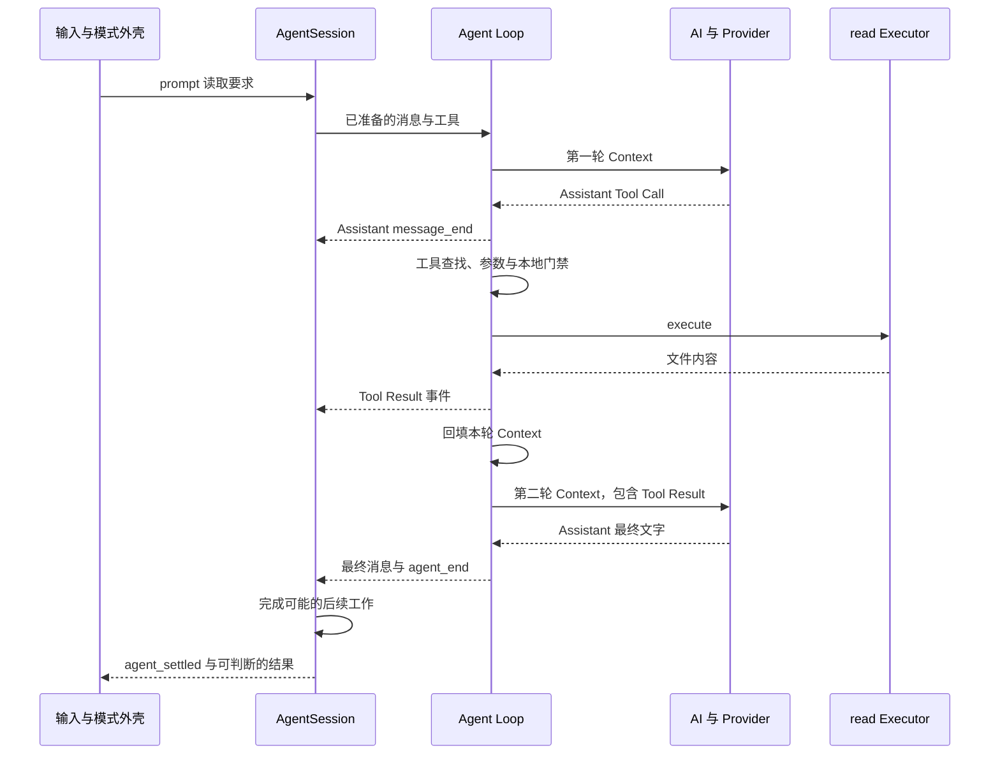
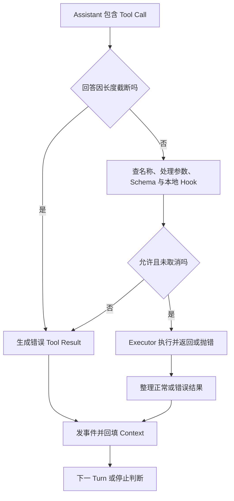

# 从用户输入追到工具结果和最终回答

假设练习文件里只有 `BOOK_TRACE_OK`。你要求“读取这个文件，只返回内容”，只开放 `read`，暂时不考虑压缩、重试和追加消息。先沿正常主线走完，再分别加上拒绝和取消。

本篇源码坐标固定 `v0.84.4`；前面的 SDK 示例使用 `0.85.1` 公共接口，不能把源码内部字段直接当作 RPC 输出合同。

## 1. 先记住四条消息

```text
User：读取练习文件
Assistant：申请 read，Call ID 为 call-1
ToolResult：call-1 对应的内容是 BOOK_TRACE_OK
Assistant：BOOK_TRACE_OK
```

第二条不是执行事实，第三条才是本地工具回执。没有第三条，模型不应凭空知道文件内容。Call ID 把申请和回执配成一对。

## 2. 正常主线按层展开



SessionManager 和界面在消息事件回流时分别工作，不是等所有工具结束才一次性补存整段对话。图省略了文字增量等微观事件，但保留了决定下一轮材料的回填步骤。

## 3. 入口准备的是一个任务，不只是字符串

`main.ts` 处理命令行、模式和运行对象。交互外壳接收编辑器提交，Print/JSON 从一次性输入进入，RPC 从 Command 进入，SDK 由外部函数调用进入。

`AgentSession.prompt()` 在低层 Agent 前协调输入处理、模板或 Skill 展开、可用模型、当前上下文、扩展和必要压缩。它不是整个进程唯一的总控：工作目录和会话整体切换还有外层 Runtime 管理。

最终给模型的材料可分为三盒：

| 材料 | 内容 | 常见误解 |
|---|---|---|
| `systemPrompt` | 系统要求与应用组织的指令 | 不等于一切本地 Markdown |
| `messages` | 当前分支有效历史和本次新增消息 | 不等于整个 Session 文件 |
| `tools` | 当前开放的名称、描述和参数 Schema | 不等于 Executor 源码或 OS 权限 |

工具说明让模型知道可以申请什么，Executor 函数仍留在本地。

## 4. AI 层翻译协议，不替模型决策

在 `packages/ai/src/models.ts` 和 Provider 实现中追查模型所属 Provider，再按 `api` 选择请求适配器。认证解析为这次请求提供身份，适配器构造厂商要求的消息、工具和 Header。

服务返回的网络流被转换为统一的文字、思考、工具请求和结束事件。因此 Agent Loop 不必为每家服务各写一套反馈循环。

需要注意两种“流”：Provider 对内部消费者提供的 `partial` 累计快照，与 JSON/RPC 对外裁剪后的增量记录并不相同。调试时先确认正在看的接口边界，不因为字段在另一层存在就断言客户端应当收到。

## 5. Agent Loop 把申请变成本地执行

在 `packages/agent/src/agent-loop.ts` 里看 `runLoop()`：接收 Assistant，判断错误或取消，收集 Tool Call，调用工具调度，把结果回填，然后决定下一 Turn。



长度截断时，即使参数侥幸能解析成 JSON，也可能不完整，不能执行。未知工具、参数错误、门禁拒绝和 Executor 抛错应形成可以辨认的错误 Tool Result。

`tool_execution_start` 可能在门禁之前发出，所以“看到工具开始事件”不等于 Executor 已进入。要证明拒绝没有副作用，应检查 Executor 调用次数或受控对象是否变化。

串行或并行执行由配置和工具声明决定，不是每条 Tool Call 都固定串行。工具结果带原 Call ID，并在批次结束后进入 Context；随后 Steering、停止 Hook 或 Follow-up 还会影响是否继续。

错误 Tool Result 通常可以回到模型，让它解释或修正。但业务入口可以像任务台一样锁存失败并取消，防止模型之后的文字覆盖真实失败。

## 6. 为什么有三个看起来相似的消息容器？

| 容器 | 用途 |
|---|---|
| 本次 `newMessages` | 汇总这次低层调用新产生的消息 |
| `currentContext.messages` | 当前 Run 的下一 Turn 会使用的材料 |
| Agent state 与 Session | 对外运行状态和跨任务、跨进程记录 |

它们有联系，但不是同一个数组。工具结果被加入输出汇总，不自动等于加入下一轮 Context；Session 里存在一条记录，也不自动等于适配器已经把它发给服务。

在固定版本中，工具结果的两次追加是两个不同职责：

```typescript
function recordResult(result: unknown, currentContext: { messages: unknown[] }, newMessages: unknown[]) {
  currentContext.messages.push(result);
  newMessages.push(result);
}
```

这只是摘出的状态关系，不是替换 Pi 的完整循环。下一篇会故意漏掉第一行，用测试解释为什么只检查第二个数组会漏报。

## 7. AgentSession 为什么还要再收尾？

低层循环不知道所有编码产品策略。一次 `agent_end` 后，AgentSession 还可能根据错误重试、压缩后继续，或处理待投递消息。只有这些自动后续都没有了，才产生 `agent_settled`。

SessionManager 根据消息结束等动作追加条目，按当前分支重建历史；Compaction 改变模型材料视图，不删除整份 Session。扩展状态是否给模型看，则取决于条目类型和转换过程。

TUI 订阅事件更新组件，再请求刷新。任务事实、组件状态和终端画面是三层：界面显示完成不能代替 Session 追加检查，也不能证明测试已通过。

## 8. 取消沿调用链向下传，清理由所有者向外收

用户按 Esc 或程序调用 abort 后，取消信号传给模型流、Hook 和 Executor。配合的下游尽快结束；忽略信号的代码可能继续运行，甚至永远不 settle。

取消不撤销已写文件和外部请求。业务副作用需要自己定义恢复方法，可靠代码恢复看 Git，不看“已取消”文字。

退出应用还要停止输入、等待活动工作、解除订阅、释放会话和终端资源。不同模式的关闭顺序并非完全相同，不能拿一条 TUI 退出日志证明 RPC 和 SDK 全部清理正确。

## 9. 带着症状找文件

从固定源码根目录可执行只读搜索：

```bash
rg -n 'async prompt|agent_settled' packages/coding-agent/src/core/agent-session.ts
rg -n 'runLoop|currentContext.messages.push|executeToolCalls' packages/agent/src/agent-loop.ts
rg -n 'streamSimple|createProvider' packages/ai/src/models.ts
rg -n 'handleInput|requestRender|setFocus' packages/tui/src/tui.ts
```

输入没进入任务，先查模式和输入处理；工具拒绝不生效，查本地执行边界；结果下一轮丢失，查 Context 回填和转换；只是画面不刷新，查组件状态和 `requestRender()`。不要从猜测 Provider 不稳定开始扩大排查。

## 10. 一分钟回忆

> **模型决定申请，Pi 本地执行；消息是下一轮材料，事件用于观察，Session 用于记录，取消和清理分别完成。**

上一篇：[源码总图与环境准备](26-源码总图与环境准备.md)。下一篇：[定位故障与恢复验证](28-定位故障与恢复验证.md)。
