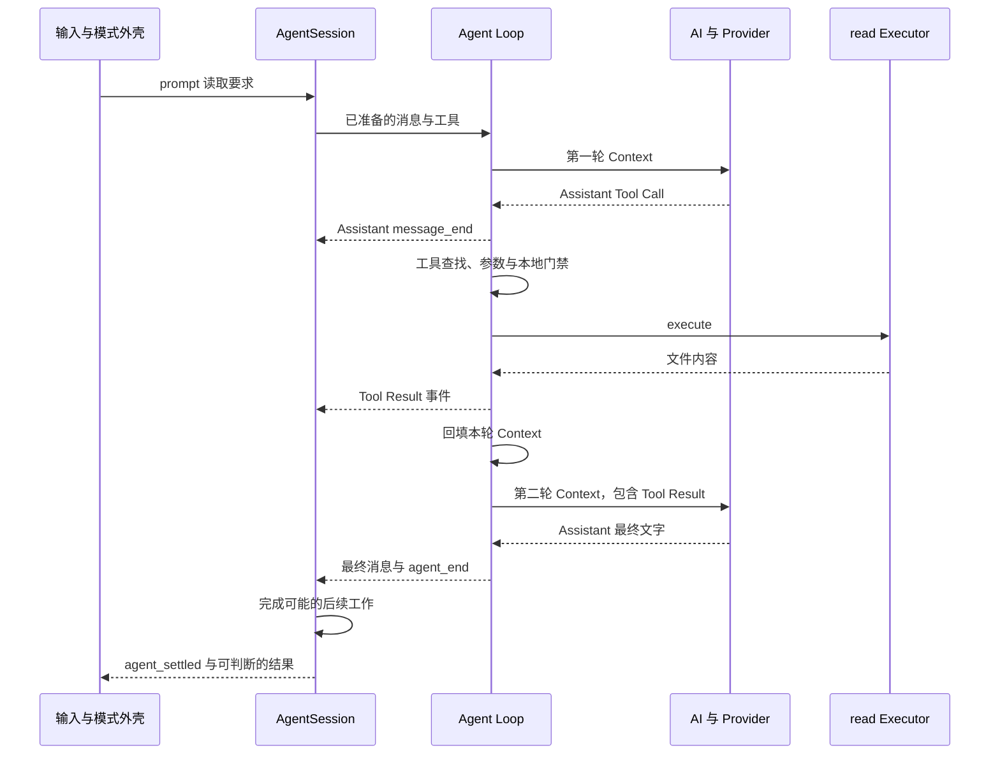
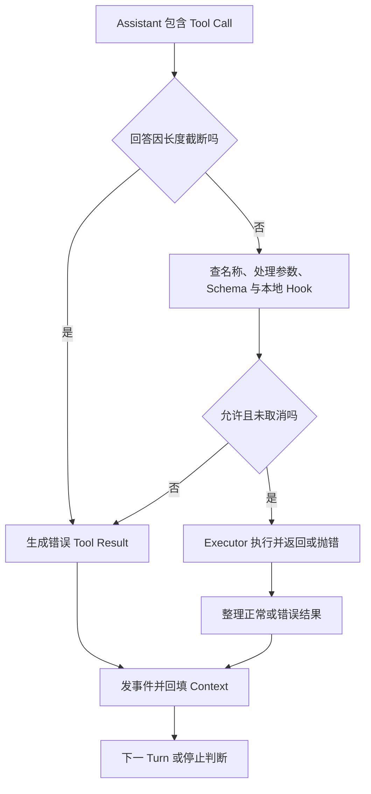

# 28 追踪一次完整请求

## 从用户输入追到工具结果和最终回答

沿用前面的读取任务：练习文件中写着 `BOOK_TRACE_OK`，你只向 Pi 提供文件路径，要求读取后原样返回内容。这段固定文字用于核对读取结果，提问中没有附加文件正文。本篇只开放 `read`，先追踪没有压缩、重试和追加消息的正常过程，再看拒绝和取消怎样改变流程。

本篇追踪的源码固定为 `v0.84.4`；前面的 SDK 示例使用 `0.85.1` 公共接口。源码内部对象与对外 RPC 消息需要分别查看，不能直接照搬字段。

## 同时追踪“谁继续执行”和“谁拿到什么材料”

一次请求有两条互相配合的主线。**控制流**是函数之间谁调用谁、等待谁、何时继续；**数据流**是输入、Tool Call、Tool Result 怎样被保存和传给下一环。

工具函数顺利返回，说明控制走过了它；工具结果是否加入下一轮请求，却是另一个数据问题。只看调用栈或日志标题，容易漏掉“代码运行了，材料没有交过去”的故障。

### 第一次模型请求为什么通常不能直接给出文件内容？

模型收到“读练习文件”时，如果材料中尚无内容，它只知道需求、路径和可申请的工具。第一轮可以提出 `read`，本地执行以后，Pi 才得到真实文件内容。第二轮把这份新事实交给模型，模型才能据此回答。

这两次模型调用共同完成一次读取任务：第一次提出申请，第二次利用取得的内容回答。同一 Turn 还可以包含多个工具申请，因此统计时要分别记录用户提问、模型生成和工具执行的次数。

### 为什么回执必须保留原调用标识？

假设同时申请读取两个文件，只有两段文字而没有对应关系，模型就可能把 A 的结果当作 B。Tool Call ID 把回执绑定到原申请；名称、参数和错误标志则说明这份事实究竟来自什么操作。

返回内容时，还要带上对应的调用 ID 和成功或失败状态。把拒绝转成成功文本，或把结果关联到另一个调用，都会影响模型的后续判断。

### 为什么会有多份消息表示？

下一轮生成需要工作材料，外部订阅者需要运行通知，Session 需要可恢复的历史，TUI 需要适合显示的状态。它们服务于不同消费者，不能假定“写入了其中一处”会自动更新其余所有位置。

下面先用时序图展示完整主线，再逐层解释输入怎样处理、工具怎样执行、结果怎样传回。读每一步时，同时查看调用了哪个函数、传入了什么数据。

## 1. 一次读取任务中的四条消息

```text
User：读取练习文件
Assistant：申请 read，Call ID 为 call-1
ToolResult：call-1 对应的内容是 BOOK_TRACE_OK
Assistant：BOOK_TRACE_OK
```

第二条记录模型提出的读取申请，第三条保存工具执行后返回的内容。Call ID 把申请和回执配成一对，模型在后续请求中取得这份文件内容。

## 2. 正常主线按层展开



SessionManager 和界面在消息事件回流时分别工作，不是等所有工具结束才一次性补存整段对话。图省略了文字增量等微观事件，但保留了决定下一轮材料的回填步骤。

## 3. 入口准备的是一个任务，不只是字符串

`main.ts` 处理命令行、模式和运行对象。交互外壳接收编辑器提交，Print/JSON 从一次性输入进入，RPC 从 Command 进入，SDK 由外部函数调用进入。

`AgentSession.prompt()` 在低层 Agent 前协调输入处理、模板或 Skill 展开、可用模型、当前上下文、扩展和必要压缩。它不是整个进程唯一的总控：工作目录和会话整体切换还有外层 Runtime 管理。

模型收到的主要材料如下：

| 材料 | 内容 |
|---|---|
| `systemPrompt` | 系统要求与应用组织的指令 |
| `messages` | 当前分支有效历史和本次新增消息 |
| `tools` | 当前开放的名称、描述和参数 Schema |

工具说明让模型知道可以申请什么，Executor 函数仍留在本地。

## 4. AI 层翻译协议，不替模型决策

在 `packages/ai/src/models.ts` 和 Provider 实现中追查模型所属 Provider，再按 `api` 选择请求适配器。认证解析为这次请求提供身份，适配器构造厂商要求的消息、工具和 Header。

服务返回的网络流被转换为统一的文字、思考、工具请求和结束事件。因此 Agent Loop 不必为每家服务各写一套反馈循环。

需要注意两种“流”：Provider 对内部消费者提供的 `partial` 累计快照，与 JSON/RPC 对外裁剪后的增量记录并不相同。调试时先确认正在看的接口边界，不因为字段在另一层存在就断言客户端应当收到。

## 5. Agent Loop 把申请变成本地执行

在 `packages/agent/src/agent-loop.ts` 里看 `runLoop()`：接收 Assistant，判断错误或取消，收集 Tool Call，调用工具调度，把结果回填，然后决定下一 Turn。



长度截断时，即使参数侥幸能解析成 JSON，也可能不完整，不能执行。未知工具、参数错误、门禁拒绝和 Executor 抛错应形成可以辨认的错误 Tool Result。

`tool_execution_start` 可能在门禁之前发出，所以“看到工具开始事件”不等于 Executor 已进入。要证明拒绝没有副作用，应检查 Executor 调用次数或受控对象是否变化。

串行或并行执行由配置和工具声明决定，不是每条 Tool Call 都固定串行。工具结果带原 Call ID，并在批次结束后进入 Context；随后 Steering、停止 Hook 或 Follow-up 还会影响是否继续。

错误 Tool Result 通常可以回到模型，让它解释或修正。业务入口也可以像任务台一样保留已发生的失败并取消任务，后续模型回复无法覆盖这个失败状态。

### 收到一条回答后，循环怎样决定下一步？

固定 `v0.84.4` 的低层主线先判断 Assistant 是否以 `error` 或 `aborted` 结束；这类响应走本轮和低层运行的收尾。正常响应则处理全部 Tool Call、回填结果，再发 `turn_end`。因此 `turn_end` 不是“这一轮业务成功”，只是这次响应与工具批次已经形成结果。

随后先询问 `shouldStopAfterTurn`：如果调用方要求停，就结束低层运行。未强制停止时，工具批次仍需要后续处理，或者有 Steering，就继续下一 Turn；工具批次可以通过 `terminate` 表达不再要求工具续轮，但这不自动抹掉排队要求。只有工具与 Steering 都不要求继续，才检查 Follow-up；有则交付并续轮，没有才产生 `agent_end`。

例如 read 成功后需要模型解释回执，正常会进入第二轮；第二轮只给出最终文字且两种队列都空，低层才结束。若此时还有“再列验证步骤”的 Follow-up，仍会多一轮。外层 AgentSession 随后还要处理自己的自动恢复，最终是否 settled 是更外层的判断。

相邻 Turn 之间也不是机械复用第一次的所有对象值。`prepareNextTurn` 可让 AgentSession 准备下一轮，按实际需要压缩材料并刷新系统提示、工具、Context、Model 或 Thinking；低层循环接收准备结果，再请求模型。这是产品策略接入通用循环的位置，不能据此声称每轮都会压缩或切模型。

## 6. 为什么有三个看起来相似的消息容器？

| 容器 | 用途 |
|---|---|
| 本次 `newMessages` | 汇总这次低层调用新产生的消息 |
| `currentContext.messages` | 当前 Run 的下一 Turn 会使用的材料 |
| Agent state 与 Session | 对外运行状态和跨任务、跨进程记录 |

它们有联系，但不是同一个数组。工具结果被加入输出汇总，不自动等于加入下一轮 Context；Session 里存在一条记录，也不自动等于适配器已经把它发给服务。

在固定版本中，工具结果的两次追加是两个不同职责：

```typescript
function recordResult(result: unknown, currentContext: { messages: unknown[] }, newMessages: unknown[]) {
  currentContext.messages.push(result);
  newMessages.push(result);
}
```

这两行分别把结果加入下一轮上下文和本次输出汇总。下一篇会故意省略 `currentContext.messages.push(result)`，用测试说明为什么只检查输出汇总会漏报。

把正常读取的四条消息代入，差别会更直观：

| 时点 | 当前 Run 的 Context | 本次低层新增消息汇总 |
|---|---|---|
| 请求第一轮前 | 已有历史与本次 User | 本次 User |
| 工具申请定稿后 | 历史、User、Assistant(toolCall) | User、Assistant(toolCall) |
| 工具回执回填后 | 历史、User、Assistant(toolCall)、ToolResult | User、Assistant(toolCall)、ToolResult |
| 最终回答定稿后 | 上项再加 Assistant(final) | 上项汇总再加 Assistant(final) |

这里 `runAgentLoop()` 的 `newMessages` 从本次传入的 prompts 开始，不复制整份旧历史；不加新 Prompt 的 `runAgentLoopContinue()` 则从空汇总开始。Context 必须保留下一轮需要的材料。事件推动 Agent state 与 Session 的更新还有各自路径。删除 Context 回填后，右列可以仍然正确，左列却少了回执；下一篇的浅层测试为什么仍绿，正是由这个差别决定。

## 7. AgentSession 为什么还要再收尾？

低层循环不知道所有编码产品策略。一次 `agent_end` 后，AgentSession 还可能根据错误重试、压缩后继续，或处理待投递消息。只有这些自动后续都没有了，才产生 `agent_settled`。

SessionManager 根据消息结束等动作追加条目，按当前分支重建历史；Compaction 改变模型材料视图，不删除整份 Session。扩展状态是否给模型看，则取决于条目类型和转换过程。

TUI 订阅事件更新组件，再请求刷新。任务事实、组件状态和终端画面是三层：界面显示完成不能代替 Session 追加检查，也不能证明测试已通过。

## 8. 取消和退出时，哪些工作需要停止？

用户按 Esc 或程序调用 abort 后，取消信号传给模型流、Hook 和 Executor。配合的下游尽快结束；忽略信号的代码可能继续运行，甚至永远不 settle。

取消不撤销已写文件和外部请求。业务副作用需要自己定义恢复方法，可靠代码恢复看 Git，不看“已取消”文字。

退出应用还要停止输入、等待活动工作、解除订阅、释放会话和终端资源。不同模式的关闭顺序并非完全相同，不能拿一条 TUI 退出日志证明 RPC 和 SDK 全部清理正确。

## 9. 带着症状找文件

从固定源码根目录可执行只读搜索：

```bash
rg -n 'async prompt|agent_settled' packages/coding-agent/src/core/agent-session.ts
rg -n 'runLoop|currentContext.messages.push|executeToolCalls' packages/agent/src/agent-loop.ts
rg -n 'streamSimple|createProvider' packages/ai/src/models.ts
rg -n 'handleInput|requestRender|setFocus' packages/tui/src/tui.ts
```

输入没进入任务，先查模式和输入处理；工具拒绝不生效，查本地执行边界；结果下一轮丢失，查 Context 回填和转换；只是画面不刷新，查组件状态和 `requestRender()`。不要从猜测 Provider 不稳定开始扩大排查。

上一篇：[源码总图与环境准备](27-源码总图与环境准备.md)。下一篇：[定位故障与恢复验证](29-定位故障与恢复验证.md)。
