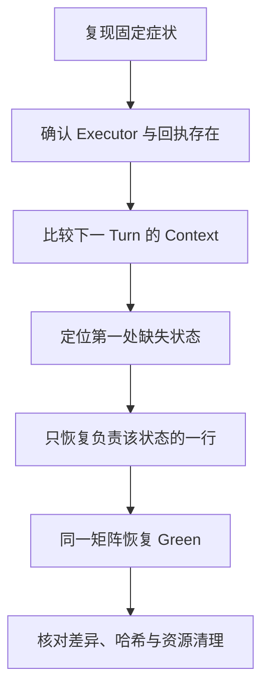

# 29 定位故障与恢复验证

## 工具执行成功，为什么模型却说没看到结果？

界面显示 `read` 返回了 marker，日志也有 Tool Result，下一轮回答却像没读过文件。此时重复执行工具可能增加副作用，却不能解释信息在哪里丢失。我们要找到第一处状态分歧。

## 为什么“有成功日志”与“任务失败”可以同时成立？

日志通常只描述某个局部事实，例如 Executor 返回了内容。最终回答却依赖后续多步都成立：回执形成、进入 Context、被适配器保留、随请求到达模型并被使用。前一步成功，并没有替后一步作保证。

所以排错不是在“日志可信”与“模型可信”之间二选一，而是明确每份证据证明哪一段。两份看似矛盾的观察，可能只是来自不同状态容器。

### 什么是不变量，为什么先说它？

**不变量**是这条功能链为了正确工作必须保持的条件。本例是：如果下一 Turn 要依据某个 Tool Result 作答，那么构造下一轮请求时必须仍能找到这个结果及其调用关系。

先明确它，才知道该写什么断言。检查“结果曾出现在事件里”没有错，但检查范围比不变量短。测试数量再多，如果都围着相同的局部输出转，也可能一起漏掉真正断开的地方。

### 故障注入为什么比反复运行更有解释力？

反复运行相同程序可以观察稳定性，却不一定知道测试会不会发现目标故障。**故障注入**是受控地破坏一个已知步骤，看看哪些观察随之改变。本例只去掉 Context 回填，保留回执与输出汇总，从而把两种职责分开。

正常、故障、恢复三组使用相同断言，分别确认基线可运行、断言能命中指定破坏、最小恢复能消除相同失败。它收窄了因果解释，但不能证明所有其他路径都正确。

### 为什么先做状态模型，再映射真实源码？

状态模型去掉网络、认证和复杂事件，只留下这次要解释的状态关系。读者可以直接观察为什么两个数组不等价，而不先处理整套构建环境。

这里的“模型”是教学用的简化程序，不是生成答案的大语言模型。它能解释机制，不能替代真实 Pi 的实现证据。后面单独标明历史源码实验与未执行部分，避免把示意程序的通过扩展成整个系统已验证。

## 1. 先冻结问题和证据面

固定一个工具结果和两次模型响应。不要同时改模型、Prompt、缓存和重试；先分别观察：

| 观察点 | 要回答的问题 |
|---|---|
| Executor | 是否执行，返回什么固定 marker |
| 工具事件与输出汇总 | 回执是否形成，Call ID 是否对应 |
| 当前 Run Context | 下一 Turn 的材料是否包含 Tool Result |
| 转换后请求 | 材料是否又被转换或过滤掉 |
| 最终结果 | 模型或脚本是否真的使用了 marker |

只记录角色、计数和虚构 marker，不打印真实 Prompt、凭据或完整 Session。

## 2. 排查顺序是一条证据链



这条链既要有正向证据，也要有反向对照。只有基线成功，才知道环境原本可运行；只有受控改动引发指定失败，才知道测试覆盖了目标；只有恢复同一改动后再次成功，才能收窄因果解释。

它仍不证明真实 Provider 永不丢数据、全部并发路径正确或生产可用。结论只跟随固定版本、固定输入和实际断言。

## 3. 先用一个无依赖状态模型解释差异

下面是状态关系的教学模型，不是重新实现 Pi，也不会调用真实模型、工具或网络。它把“工具回执已形成”和“回执进入下一轮材料”拆成可独立断言的两件事。

在独立练习目录创建 `context-trace.mjs`：

```javascript
export function traceResult() {
  const user = { role: "user", content: "read fixture" };
  const request = { role: "assistant", callId: "call-1" };
  const result = { role: "toolResult", toolCallId: "call-1", content: "BOOK_TRACE_OK" };
  const currentContext = { messages: [user, request] };
  const newMessages = [request];
  const events = [{ type: "message_end", message: result }];

  currentContext.messages.push(result);
  newMessages.push(result);

  const received = currentContext.messages.find((message) => message.role === "toolResult");
  const answer = received?.content ?? "RESULT_MISSING";
  return { events, newMessages, roles: currentContext.messages.map((message) => message.role), answer };
}
```

创建 `context-trace.test.mjs`：

```javascript
import assert from "node:assert/strict";
import test from "node:test";
import { traceResult } from "./context-trace.mjs";

test("shallow: result exists in events and output", () => {
  const run = traceResult();
  assert.equal(run.events[0].message.toolCallId, "call-1");
  assert.ok(run.newMessages.some((message) => message.role === "toolResult"));
});

test("context: next turn receives the result", () => {
  assert.deepEqual(traceResult().roles, ["user", "assistant", "toolResult"]);
});

test("answer: next turn uses the marker", () => {
  assert.equal(traceResult().answer, "BOOK_TRACE_OK");
});
```

```bash
node --test context-trace.test.mjs
```

基线应为 `3 passed / 0 failed`。未通过基线时先诊断环境或原文差异，不进入故障注入。

## 4. 只删除一行，观察哪些测试仍然绿

仅在这个练习文件中删除 `currentContext.messages.push(result);`，保留 `newMessages.push(result);`，再运行同一命令。

| 检查 | 基线 | 删除回填后 | 恢复原行后 |
|---|---|---|---|
| 事件和输出汇总 | Green | Green | Green |
| 下一 Turn 角色 | Green | Red | Green |
| 下一 Turn 使用 marker | Green | Red | Green |

故障态预期 `1 passed / 2 failed`，进程非零退出。浅层测试仍 Green，因为它只看事件和输出，没有检查下一轮使用的 Context；后两个失败才命中丢失信息的不变量。

恢复那一行，再跑到 `3 passed / 0 failed`，核对测试文件没有修改，其他文件没有变化。不能通过删除断言、把预期改成 `RESULT_MISSING` 或让脚本无条件回答成功来“修复”。

## 5. 用调试器观察角色，不扩散正文

需要停住观察时，先创建 `debug-trace.mjs`，让程序实际调用待观察函数：

```javascript
import { traceResult } from "./context-trace.mjs";
traceResult();
```

```bash
node inspect debug-trace.mjs
```

进入 Node 调试提示符后，用 `sb('context-trace.mjs', 14)` 给 `return` 行设置断点，再输入 `cont` 继续到函数返回前。如果文件行数因修改改变，先核对断点位置；目标是返回前，不是死记行号。

暂停时通过 `exec currentContext.messages.map(m => m.role)`、`exec newMessages.map(m => m.role)` 比较角色，完成后 `.exit` 关闭调试器。此处 `exec` 是 Node 调试提示符命令，不是 Shell，也不是 Pi 的工具。

Node Inspector 能执行程序表达式，具有被调试进程权限。只使用本机回环地址和虚构数据，不对外暴露调试端口，不在真实 Session 或认证对象上求值。

自动测试能验证断言，不能替代你检查断点是否真的停在目标函数。本教程的状态模型测试与真实源码调试证据分别记录。

## 6. 把同一思路映射回固定 Pi 源码

原 `v0.84.4` 受控实验在独立源码副本中，仅删除 `packages/agent/src/agent-loop.ts` 的同一条 Context 回填，官方源码原件不动。三个实际测试坐标是：

| 所在位置 | 测试名称与关注点 |
|---|---|
| `packages/agent/test/agent-loop.test.ts` | `should handle tool calls and results`，看执行、事件与输出 |
| 同一文件 | `should stop after the current turn when shouldStopAfterTurn returns true`，看回调收到的 Context |
| `packages/coding-agent/test/suite/agent-session-model-extension.test.ts` | `allows extension tool_result handlers to modify tool results`，看 patched 结果能否被后续回答使用 |

历史实际矩阵也是 `G/G/G -> G/R/R -> G/G/G`。Core 回调在故障态只有 `user, assistant`；产品层 Agent state 仍有 patched Tool Result。Inspector 只观察了角色和 patched 布尔值，没有动态读取磁盘 Session entry。

因此准确结论是“结果已经形成并到达 Agent state，但当前 Run Context 未回填”。SessionManager 的追加路径还有静态源码依据，不能把它写成这次已经直接检查磁盘 JSONL。

复现实验需要另行准备独立副本、核对版本、依赖和源码哈希，再按第 27 篇的环境边界运行指定测试。本篇不自动修改官方源码，也不把上面的无依赖状态模型当作本轮重跑了 Pi mutation。

## 7. 一份可复用的排查报告

```text
目标：定位工具回执已出现、下一轮却未收到的原因。
固定条件：版本、输入、工具、脚本响应与重试策略。
现象：哪个输出正常，哪个结果异常。
直接证据：命令、退出码、角色序列、计数和脱敏 marker。
首个分歧点：从哪个函数或状态容器开始缺失。
根因：违反了什么必须成立的不变量。
最小修改：只改了哪个行为，为什么足够。
恢复：同一测试矩阵、原文或哈希、Git 差异和资源残留。
边界：未运行的测试、真实服务、持久化或系统权限限制。
```

报告不要只写“修复成功”，也不要堆整份调试日志。读者应该能沿着证据重建判断，明确哪里是事实，哪里是推断。

本篇状态模型与官方源码实验的准备方式以上文为准，不在 `labs` 中另存一份代码。已有实验可从[总入口](../../labs/README.md)查找；[8.8 综合运行手册](../../labs/8.8-capstone/README.md)用于后续组合验收，不替代本篇的故障定位证据。

上一篇：[追踪一次完整请求](28-追踪一次完整请求.md)。返回：[教程目录](README.md)。
