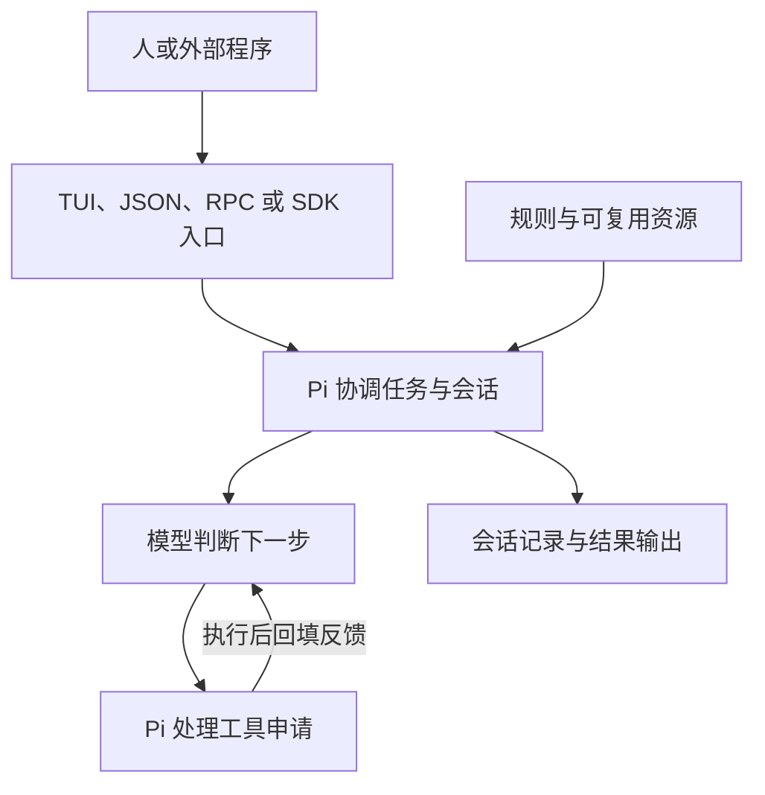

# Pi 中文教程

第一次接触 Agent、Model、Harness、Skills、MCP 等名词，先读[00 AI 应用概念导读](00-AI应用概念导读.md)。从一个完整任务建立初步印象，再回到本页认识 Pi，最后进入 01 安装与第一次对话；不需要先背完术语。

Pi 不是一个装在终端里的模型，而是围绕模型组织任务的程序：它准备材料、接收模型提出的工具申请、执行本地动作、把结果交回模型，并管理记录与交互。这套教程从这条主线出发，解释每个核心概念为什么存在、怎样工作，以及与其他部分有什么关系。

适合会基本编程、尚未接触 Pi 的读者。首次阅读可以先走完各篇的概念与流程，再用后面的示例验证理解；不需要边读边安装所有依赖或调用所有服务。贯穿场景仍是“小书架”，必要知识在本文系列中讲清，不要求返回旧教程或先啃完实验源码。

阅读时先跟着一个具体问题走完过程，再把术语对应到已经看见的动作，最后进入代码和异常。判断是否理解一个核心主题，可以试着说明：谁接到输入、谁执行动作、材料和状态怎样改变、下一步由什么触发，以及失败或取消后还留下什么。会话树尤其要同时看树关系、活动位置、模型材料和磁盘文件；只记住 Tree、Fork、Clone 三个名字还不够。

## 先看系统地图

这是职责地图，不是精确事件时序。中间的回环是关键：模型负责提出下一步，Pi 负责执行和反馈；只在屏幕上看到一句回答，并不能说明每个动作已经发生或保存。

围绕这条回环，整套内容分为四层：

| 要理解的问题 | 对应概念 | 阅读范围 |
|---|---|---|
| 谁判断、谁行动，一次任务怎样结束？ | Harness、Model、Provider、Agent Loop、Tool、Turn、Run、事件与终态 | 01-08 |
| 每次判断依据什么，历史怎样继续？ | 配置、规则、Prompt、Context、Session、Branch、Compaction、模板与 Skill | 09-14 |
| 怎样改变行为、交付能力、接入模型？ | Extension、Hook、命令、状态、Package、认证、模型目录与协议适配 | 15-22 |
| 怎样交给自己的程序控制，并解释故障？ | SDK、Runtime、RPC、TUI、资源所有权、源码控制流与数据流 | 23-29 |

## 阅读路线

从[00 AI 应用概念导读](00-AI应用概念导读.md)开始，先看通用职责与相互关系，再按下面 01-29 的顺序进入 Pi 专题。

### 第一层：理解任务怎样运行

| 章节 | 先弄明白什么 |
|---|---|
| [01 安装与第一次对话](01-安装与第一次对话.md) | Pi、模型、工具和记录各自负责什么 |
| [02 Pi 如何读取文件](02-Pi如何读取文件.md) | 为什么读文件需要工具申请、执行与下一轮反馈 |
| [03 终端输入与快捷键](03-终端输入与快捷键.md) | 输入、焦点、显示与任务事实有什么区别 |
| [04 基础工具与操作边界](04-基础工具与操作边界.md) | 工具描述、参数 Schema、Executor 与权限怎样配合 |
| [05 完成一次开发任务](05-完成一次开发任务.md) | 目标、范围、测试、Git 和模型回答分别证明什么 |
| [06 模型选择与用量](06-模型选择与用量.md) | 能力、Thinking、Token、上下文窗口和费用为何不同 |
| [07 取消、重试与追加消息](07-取消重试与追加消息.md) | 改向、排队、取消、停止和成功发生在什么时机 |
| [08 一次性运行与结构化输出](08-一次性运行与结构化输出.md) | Message、Event、State 与进程退出怎样共同解释结果 |

### 第二层：理解材料与历史怎样组织

| 章节 | 先弄明白什么 |
|---|---|
| [09 项目配置与规则](09-项目配置与规则.md) | 配置控制程序，规则进入材料，权限由执行环境决定 |
| [10 常用设置与配置排查](10-常用设置与配置排查.md) | 保存的值、加载的值与当前运行值为何不一定相同 |
| [11 保存、恢复与会话分支](11-保存恢复与会话分支.md) | Session 如何保存路线，为什么切分支不恢复文件 |
| [12 会话记录与上下文压缩](12-会话记录与上下文压缩.md) | 历史如何变成请求材料，摘要保留什么、损失什么 |
| [13 提示词模板与技能](13-提示词模板与技能.md) | 重复输入、任务方法和可执行能力该放在哪里 |
| [14 主题与资源重载](14-主题与资源重载.md) | 发现、加载、启用与重载如何影响当前进程 |

### 第三层：理解定制与模型接入

| 章节 | 先弄明白什么 |
|---|---|
| [15 第一个扩展与生命周期](15-第一个扩展与生命周期.md) | 宿主怎样注册扩展、触发回调并提供执行上下文 |
| [16 自定义工具与命令](16-自定义工具与命令.md) | 用户命令和模型工具走哪条路，结果给谁看 |
| [17 危险命令审批与状态保存](17-危险命令审批与状态保存.md) | 批准、执行、记录和显示为什么必须分开 |
| [18 扩展测试与资源清理](18-扩展测试与资源清理.md) | 异步工作由谁取消和释放，各层测试证明到哪里 |
| [19 打包、安装与资源管理](19-打包安装与资源管理.md) | npm 制品与 Pi 资源声明怎样共同交付能力 |
| [20 模型接入与认证](20-模型接入与认证.md) | 模型、服务、协议、目录和身份怎样组成一次访问 |
| [21 自定义模型配置](21-自定义模型配置.md) | 元数据描述什么，什么时候配置足够、什么时候不够 |
| [22 自定义服务商扩展](22-自定义服务商扩展.md) | 接入层怎样保留消息、流、工具往返和终态的含义 |

### 第四层：理解程序集成与内部实现

| 章节 | 先弄明白什么 |
|---|---|
| [23 使用 SDK 提交与控制任务](23-使用SDK提交与控制任务.md) | 应用接管什么，运行对象如何协作，结果从哪里取得 |
| [24 RPC 协议与 Java 客户端](24-RPC协议与Java客户端.md) | 跨进程后为什么需要分帧、回执关联和状态合并 |
| [25 终端组件与界面刷新](25-终端组件与界面刷新.md) | 焦点、状态、缓存、布局和刷新怎样形成画面 |
| [26 构建任务台与异常测试](26-构建任务台与异常测试.md) | 单任务、取消、持久化和关闭如何落实资源所有权 |
| [27 源码总图与环境准备](27-源码总图与环境准备.md) | 包、进程与运行对象如何对应，复现需要固定什么 |
| [28 追踪一次完整请求](28-追踪一次完整请求.md) | 控制流与数据流怎样把工具结果送到下一次生成 |
| [29 定位故障与恢复验证](29-定位故障与恢复验证.md) | 为什么局部成功仍可能整体失败，如何找到首个分歧 |

## 容易混淆的概念

| 看起来相近 | 实际区别 |
|---|---|
| Pi 与 Model | Pi 组织和执行任务，Model 根据材料生成下一步 |
| Prompt 与 Context | Prompt 是输入要求的一部分，Context 是当前生成使用的完整材料 |
| Tool Call 与 Tool Result | 前者是申请，后者是执行或拒绝后形成的反馈 |
| Turn、Run 与 Session | 一次模型响应及工具处理、连续运行过程、跨任务的记录范围 |
| Session 与 Git | 一个保存对话路线，一个保存受版本控制的文件状态 |
| Compaction 与 Cache | 一个用摘要重组材料，一个复用符合服务条件的计算 |
| Skill 与 Extension | 一个主要提供任务方法，另一个是宿主加载的可执行代码 |
| Command 与 Tool | 前者由用户入口触发，后者可由模型提出结构化申请 |
| Provider 与 API Adapter | 前者组织接入行为，后者转换具体协议 |
| SDK 与 RPC | 同进程直接调用对象，与跨进程交换协议记录 |
| agent_end 与 agent_settled | 一次低层运行结束，与当前不再有自动后续；两者都不等于业务成功 |
| 取消与恢复 | 一个请求停止后续工作，一个处理已经发生的状态变化 |

这些是理解入口，不是替代正文的封闭词典。尤其是 Context、Runtime、Model 等词，在不同层可能指不同对象，阅读时要带上所在接口与版本。

## 按问题查找

| 遇到的问题 | 从哪里开始 |
|---|---|
| Return 发送了消息，怎样换行？ | 03 的多行输入和快捷键速查 |
| 模型说读过了，如何确认？ | 02 的 Tool Result；28 的消息与执行链 |
| 配置写了却没生效 | 09 的加载范围；10 的单变量排查 |
| 取消后文件为什么没有恢复？ | 04 的副作用边界；07 的取消范围 |
| 想接着上次任务继续 | 11 的恢复；12 的长任务断点 |
| 重复提示应该做成哪种资源？ | 13 的规则、模板、Skill 和扩展选型 |
| 扩展无界面或重载后行为异常 | 15 的模式；18 的清理与测试 |
| 接入一个新模型服务 | 20 选型，再按需要读 21 或 22 |
| Java 收到 success 却没有答案 | 24 的 accepted、事件和终态 |
| 测试全绿仍然漏掉工具结果 | 29 的浅层断言和 Context 对照 |

## 版本与练习

需要查看现有实验时，从[实验总入口](../../labs/README.md)按本教程章节定位。那里区分样本练习、深入验证和综合项目，并列出锁定版本、离线检查与真实模型入口；不需要把所有 Lab 依次启动。

使用说明和新增示例按 Pi `0.85.1`、macOS 编写，Node.js 至少 `22.19.0`。旧案例保留各自锁定版本：扩展 `0.84.1`、Package 验证 CLI `0.84.2`、任务台 `0.84.3`、源码 `v0.84.4`。查 API 时先对齐所读版本，不直接升级旧 Lab。

每篇区分本地演示和真实调用。Provider 脚本、组件方法测试和状态模型不产生真实推理；模型对话、认证、依赖安装、打包安装和 Git 操作需要分别确认。目录隔离、环境清空、文字规则和工具允许列表都不是操作系统沙箱。

学习进度、作者侧验证、内容验收和维护来源统一见[完整学习计划](../plans/pi-complete-learning-plan.md)。本目录覆盖阶段 0-8.7，毕业项目 8.8、网站和新业务系统不包含在这组教程里。
