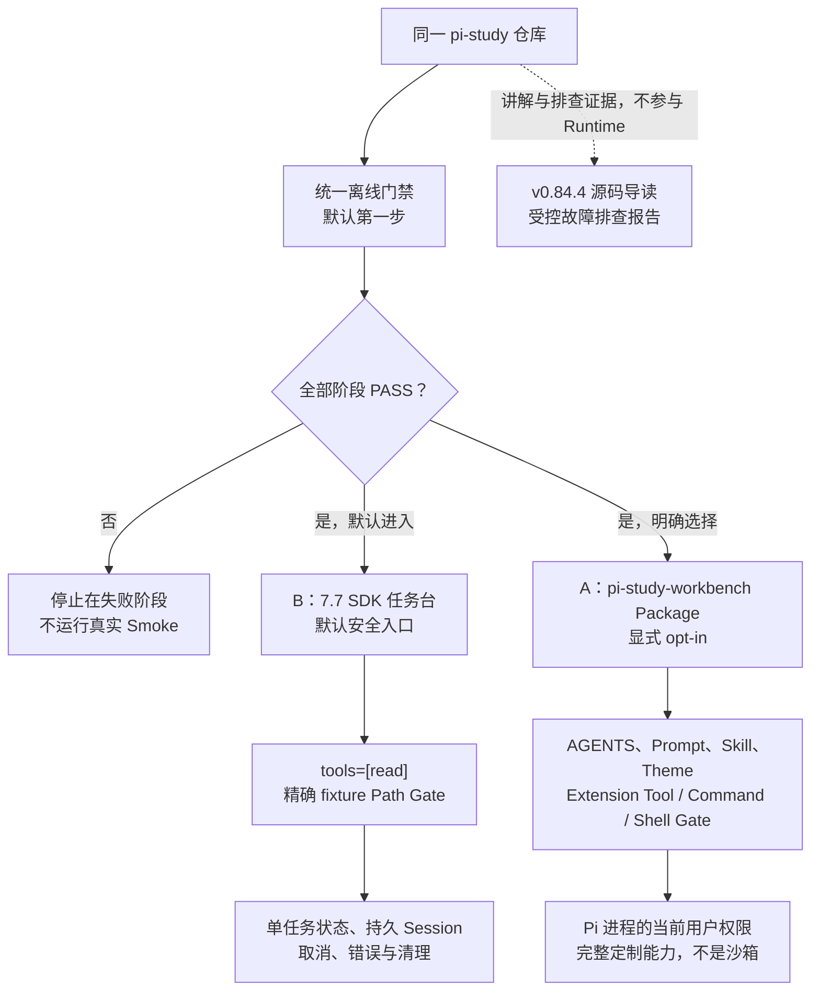

# 8.8 Pi 毕业综合项目运行手册

先读[25 任务台与异常测试](../../docs/tutorials/25-构建任务台与异常测试.md)和[28 故障定位与恢复](../../docs/tutorials/28-定位故障与恢复验证.md)，再进入本综合项目的独立验收。返回[实验总入口](../README.md)。

本毕业项目在同一仓库保留两个工作面：SDK 任务台是默认安全入口，根 `pi-study-workbench` Package 是显式 opt-in 的完整交互入口。两者共享项目规则和学习资产，但不共用 Runtime，也不能被描述成同一安全等级。默认先运行无 Provider 总门禁；真实 Smoke 只在独立授权后执行。

## 双入口架构



SDK Path Gate 只接受 `labs/7.7-sdk-task-console/fixture.txt` 的规范相对路径，或同一目标的规范绝对路径。`./`、`..`、重复分隔符、其他文件、缺失目标、目录、非字符串、已取消请求、硬链接，以及最终项、任一父目录、仓库根本身或其任一祖先为符号链接时都拒绝。已有 `beforeToolCall` 只在初检通过后运行；它若改写参数，终检会再次执行同一门禁。拒绝统一形成 `Read request blocked by task path policy` 错误 Tool Result，真实 `read.execute` 不启动。终检与真正打开文件之间仍存在同用户替换文件的 TOCTOU 边界，因此它是进程内门禁，不是操作系统沙箱。

Package 入口加载根 Manifest 声明的 Extension、Skill、Prompt Template 和 Theme。Shell Gate 不覆盖内置 `edit`、`write`，也不限制其他 Extension 或 Pi 进程可直接使用的系统能力；只有明确接受完整能力边界后才进入该工作面。

RPC 对比：7.4 是长期子进程与 LF JSONL 协议样例，只用于说明外部集成差异，不是毕业项目默认入口或总门禁。

## 版本矩阵

| 资产 | 冻结版本 | 证据位置 | 使用边界 |
|---|---:|---|---|
| `pi-study-guard` Extension 开发与自动测试 | Pi 包 `0.84.1` | [Extension lockfile](../../.pi/extensions/pi-study-guard/package-lock.json) | 证明该锁定依赖下的类型和测试合同，不代表其他 Pi 版本自动兼容 |
| `pi-study-workbench` Package 制品链 | Pi CLI `0.84.2` 历史基线 | [0.84.2 CLI lockfile](../7.1-sdk/package-lock.json)、[6.3 Package 实验](../6.3-local-package/README.md) | 总门禁中的 Package A/B 加载实验会校验该版本；不能用当前其他版本伪装通过 |
| 7.7 SDK 任务台 | SDK `0.84.3` | [SDK lockfile](../7.7-sdk-task-console/package-lock.json) | 默认安全入口的 Runtime、Session、状态和 Path Gate 合同 |
| 官方源码导读与故障报告 | `v0.84.4`，Commit `b79e4cc834970cca69daebffab7df1da7d1e52c4` | [源码与综合项目](../../docs/learning/09-source-and-capstone.md) | 只作固定源码证据和讲解坐标，不替换前三条运行版本 |

这四行是诚实的分层快照，不是“整个项目统一运行在 `0.84.4`”。任何升级都要按受影响资产重新核对类型、测试、资源加载、SDK 行为和证据边界。

## 新环境准备

前置条件：完整 Git checkout、POSIX Shell、`git`、`tar`、`which`、Node.js `>=22.19.0`，以及能读取 lockfile v3 的 npm。复现实验建议使用已记录的 npm `11.6.2`。离线总门禁不需要 Provider 凭据，也不会替操作者安装依赖。

先在仓库根从三份精确 lockfile 安装依赖；命令禁用 lifecycle scripts、optional 包、audit 和 fund 请求：

```bash
npm --prefix .pi/extensions/pi-study-guard ci --ignore-scripts --omit=optional --audit=false --fund=false
npm --prefix labs/7.1-sdk ci --ignore-scripts --omit=optional --audit=false --fund=false
npm --prefix labs/7.7-sdk-task-console ci --ignore-scripts --omit=optional --audit=false --fund=false
```

然后把 `PI_BIN` 精确指向 7.1 lockfile 安装出的 Pi CLI；不要使用当前 `PATH` 中的任意 `pi`，也不要用 `0.84.1`、`0.84.3` 或 `0.84.4` 冒充：

```bash
export PI_BIN="$PWD/labs/7.1-sdk/node_modules/@earendil-works/pi-coding-agent/dist/cli.js"
"$PI_BIN" --version
```

预期版本输出精确为 `0.84.2`。安装命令可能访问 npm Registry 下载锁定制品，但不会调用 Model Provider；供应链内容与完整性仍要按组织策略独立审查。

## 统一离线门禁

稳定入口固定为：

```bash
node labs/8.8-capstone/run-capstone-check.mjs
```

根脚本提供等价别名：

```bash
npm run capstone:check
```

Runner 不安装依赖，不运行 `smoke`，也不进入 7.1、7.2 或其他外部客户端。它移除传给子进程的常见敏感凭据环境变量，设置 npm/Pi offline，并顺序执行以下阶段：

| 阶段 | 检查内容 |
|---|---|
| `extension` | `pi-study-guard` 严格 TypeScript 与确定性测试 |
| `package-artifact` | 根 Package Manifest、tarball 清单、源码/解包资源等价和临时清理 |
| `sdk-task-console` | SDK 任务台类型、状态、Session、清理、Path Gate 和真实 SDK Fake Runtime 测试 |
| `required-structure` | 毕业项目要求的规则、资源、实现和稳定文档入口均存在且为普通文件 |
| `sensitive-patterns` | 授权目录内的有限高置信凭据模式扫描，不回显命中内容 |
| `residuals` | 仓库内没有 `.env`、认证文件、Session JSONL、tarball、租约或非 fixture 日志残留 |

成功时输出以下固定摘要并以 `0` 退出：

```text
stage=extension status=PASS
stage=package-artifact status=PASS
stage=sdk-task-console status=PASS
stage=required-structure status=PASS
stage=sensitive-patterns status=PASS
stage=residuals status=PASS
result=PASS
```

失败时只输出当前阶段的 `status=FAIL errorKind=<固定枚举>` 和 `result=FAIL`，以 `1` 退出，并停止后续阶段。每个固定子命令最多等待 180 秒；超时只保证 Runner 请求终止直接子进程，不证明任意后代进程或进程树已全部退出。Runner 故意不回显子进程 stdout、stderr、异常正文、绝对路径或命中内容；失败或超时后先检查相关进程和残留，再按失败阶段运行对应的直接离线命令，不要转而运行真实 Smoke。

## 手工验收清单

### 1. 默认离线总门禁

- 命令：`node labs/8.8-capstone/run-capstone-check.mjs`。
- 输入：无。
- 预期：六个固定阶段依次 `PASS`，末行 `result=PASS`；没有 Provider/Model 输出。
- 退出：成功为 `0`，首个失败为 `1`。
- 清理：Runner 与子实验自行清理操作系统临时目录；`residuals` 只证明仓库扫描范围内没有受控残留。

### 2. Package 交互入口，无 Provider

先创建隔离 `HOME` 与 Agent 目录，再启动明确 opt-in 的 Package 工作面：

```bash
CAPSTONE_PACKAGE_ROOT="$(mktemp -d)"
mkdir -m 700 "$CAPSTONE_PACKAGE_ROOT/home" "$CAPSTONE_PACKAGE_ROOT/agent"
HOME="$CAPSTONE_PACKAGE_ROOT/home" \
PI_CODING_AGENT_DIR="$CAPSTONE_PACKAGE_ROOT/agent" \
PI_OFFLINE=1 \
"$PI_BIN" -e "$PWD" --approve --no-session --no-tools
```

- 输入：只输入 `/study-inspect 09-source-and-capstone.md`，观察一次有界标题/链接摘要；随后输入 `/quit`。不要在本项提交普通 Model Prompt。
- 预期：Slash Command 被识别并返回固定格式摘要；没有 Agent Run、Tool Call、Provider 请求或 Session 文件。
- 退出：`/quit` 正常返回 Shell；若资源加载或 Command 失败，本项不通过。
- 清理：确认 Pi 已退出后执行 `test -n "${CAPSTONE_PACKAGE_ROOT:-}" && rm -r -- "$CAPSTONE_PACKAGE_ROOT"`，再执行 `unset CAPSTONE_PACKAGE_ROOT`。

同一仓库根的项目自动发现可能与显式 `-e "$PWD"` Source 发生规范化去重。本项只证明本次带显式 Source 的运行中只读 Command 可用，不单独证明资源实例来自哪条发现路径；Manifest、源码根/归档根资源集合和制品清单由 `package-artifact` 阶段证明。它也不证明自定义 Tool 的 Model 选择、Prompt/Skill 的真实回答、Shell Gate 全矩阵或 Package 是沙箱。

### 3. SDK 默认入口启动与退出，无 Provider

本项同样隔离 `HOME`、Agent 和 Session 目录：

```bash
CAPSTONE_SDK_ROOT="$(mktemp -d)"
mkdir -m 700 "$CAPSTONE_SDK_ROOT/home" "$CAPSTONE_SDK_ROOT/agent"
HOME="$CAPSTONE_SDK_ROOT/home" \
PI_CODING_AGENT_DIR="$CAPSTONE_SDK_ROOT/agent" \
PI_STUDY_77_SESSION_DIR="$CAPSTONE_SDK_ROOT/session" \
PI_OFFLINE=1 \
npm --prefix labs/7.7-sdk-task-console run console
```

- 输入：看到 `status=READY session=NEW model=openai/gpt-5.6-sol tools=read` 后，只输入 `/quit`。
- 预期：`STARTING -> READY`，Tool 集合精确为 `read`；没有任务、`READING` 或 Provider 请求。
- 退出：正常退出为 `0`，租约释放。
- 清理：确认进程已退出后执行 `test -n "${CAPSTONE_SDK_ROOT:-}" && rm -r -- "$CAPSTONE_SDK_ROOT"`，再执行 `unset CAPSTONE_SDK_ROOT`。

本项证明默认入口、模型/Tool 静态合同和清理链可启动，不证明 Path Gate 已拦截请求或真实模型可用。

### 4. SDK Path Gate 拒绝路径，无 Provider

```bash
node --test \
  --test-name-pattern='blocks before the real SDK read executor' \
  labs/7.7-sdk-task-console/test/read-path-gate.test.ts
```

- 输入：测试内固定让脚本 Model 请求 `read` 仓库根 `AGENTS.md`。
- 预期：聚焦用例通过，并断言固定错误 Tool Result 已形成、真实 SDK `read.execute` 调用次数为 `0`；测试不会输出目标路径或文件正文。
- 退出：通过为 `0`，断言失败为非零。
- 清理：测试使用操作系统临时目录并在 `finally` 中删除；无需删除 Session 或认证文件。

Assistant 后续说“已拒绝”不能单独证明 Executor 未运行；本项以 `executeCount=0` 和错误 Tool Result 断言作为拒绝证据。

### 5. SDK 允许路径真实 Smoke，可选

本项会读取现有 Pi 认证并产生真实 Provider 请求和潜在费用，只有在离线门禁通过且取得本次独立授权后才执行。这里不得覆盖 `HOME` 或 `PI_CODING_AGENT_DIR`，否则隔离目录中没有现有认证：

```bash
CAPSTONE_SMOKE_ROOT="$(mktemp -d)"
PI_STUDY_77_SESSION_DIR="$CAPSTONE_SMOKE_ROOT/session" \
npm --prefix labs/7.7-sdk-task-console run smoke
```

- 输入：脚本固定要求只调用一次 `read` 读取规范路径 `labs/7.7-sdk-task-console/fixture.txt`，无需人工输入。
- 预期：只出现一次 `status=READING tool=read`，随后出现 `status=COMPLETED saved=true` 和 `answer="TASK_CONSOLE_REAL_MARKER_7701"`，且没有 `FAILED` 或 `CANCELLED`。
- 退出：完整合同通过为 `0`；超时、取消、错误或输出不符为非零。一次 Agent Run 仍可能包含多次 Provider 请求。
- 清理：确认进程已退出后删除本轮 `CAPSTONE_SMOKE_ROOT` 并 unset 变量；异常结果先保留脱敏摘要并查因，不盲目重试不确定请求。

一次真实成功只证明该时间、账号、Model、固定 Prompt、fixture 和本地清理链，不证明费用准确、远端取消、任意路径安全、长期稳定或生产可用性。

### 6. Git 冻结与提交门禁

在所有工程与手工验收完成后执行：

```bash
git -c core.quotePath=false status --short
git -c core.quotePath=false status --porcelain=v1 -z
git ls-files --others --exclude-standard -z
git diff --check
git diff --cached --check
```

- 输入：无。
- 预期：提交前以 NUL 分隔结果核对完整候选文件集和单独的未跟踪文件集，只包含本次约定路径；无意外凭据、Session、tarball 或临时日志，两层 `diff --check` 都为 `0`。
- 退出：任何意外路径或格式错误都先停止，不提交、不推送。
- 清理：只清理已确认属于本轮且可恢复的临时产物，不覆盖用户已有改动。获得单独提交授权并提交后，再记录 `git rev-parse HEAD`，并要求 `git status --porcelain=v1 -z` 输出精确为零字节。

`git diff --check` 不读取未跟踪文件内容，Runner 也不决定某个未跟踪路径是否属于最终候选；未跟踪文件必须在本 Git 门禁中单独审查。文档存在、Runner `PASS`、真实 Smoke 成功、Git Commit 和远端 Push 是不同证据。毕业项目只有在唯一计划记录完整验收、学习者能独立讲解，并完成最终 Git 冻结/授权提交门禁后才能标记完成。

## 讲解路线

按以下顺序可在 5 到 10 分钟内讲清项目，不需要展示凭据或 Session 正文：

1. 用[双入口架构](#双入口架构)说明为什么默认选择 SDK，Package 为什么必须显式 opt-in。
2. 用[版本矩阵](#版本矩阵)说明四个资产不是同一 Pi 版本，避免把源码版本外推为运行版本。
3. 运行[统一离线门禁](#统一离线门禁)，逐层解释 Extension、Package、SDK 与静态收尾门禁分别证明什么。
4. 从 [SDK README](../7.7-sdk-task-console/README.md) 讲单任务状态、Session、取消/清理，再用 Path Gate 的允许/拒绝集合解释最小能力。
5. 从[源码跨包追踪](../../docs/learning/09-source-and-capstone.md#一次完整-read-任务的跨包追踪)讲 `User -> Assistant(toolCall) -> ToolResult -> Assistant(final)`，区分任务事实、事件、Context 与 Session。
6. 从[受控故障排查报告](../../docs/learning/09-source-and-capstone.md#受控故障排查报告)讲浅层 Green 为什么不够、首个分歧点如何定位、单行恢复怎样形成因果闭环。
7. 最后回到[Git 冻结与提交门禁](#6-git-冻结与提交门禁)，明确自动测试、真实调用、提交与发布不能互相替代。

## 安全与证据边界

- 默认命令不读取 Provider 凭据、不调用 Provider、不产生模型费用、不发布 npm、不提交或推送 Git。
- Runner 的敏感扫描只覆盖列出的目录、文本类型、大小上限和有限高置信模式；`PASS` 不是完整秘密扫描或供应链审计。
- Runner 的子命令超时不保证任意后代进程已结束；超时后的进程与残留检查是独立门禁。
- SDK 的 `tools=[read]` 加精确 Path Gate 显著缩小能力，但进程仍以当前用户运行；Path Gate 也保留同用户 TOCTOU 边界。
- SDK Session JSONL 会明文保存 Prompt、消息和 Tool Result；必须位于仓库外私有目录，不得提交或共享。
- Package 入口拥有完整定制能力，内置写 Tool、其他 Extension、用户 Shell 和直接系统 API 都是独立边界。
- 自动测试、Fake Runtime、本地真实 Pi、真实 Provider、Git Commit、Push 和生产行为是不同证据层，任何一层成功都不能替代另一层。
